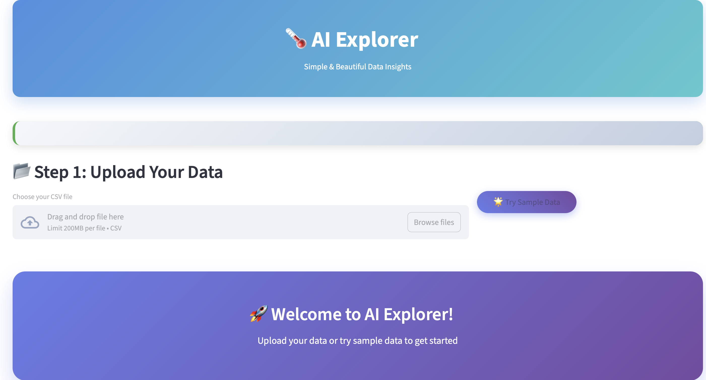
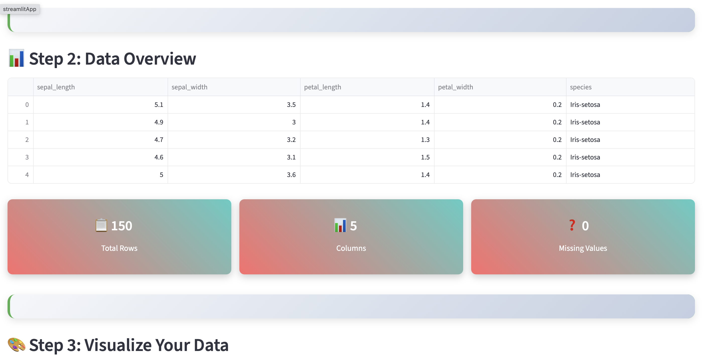
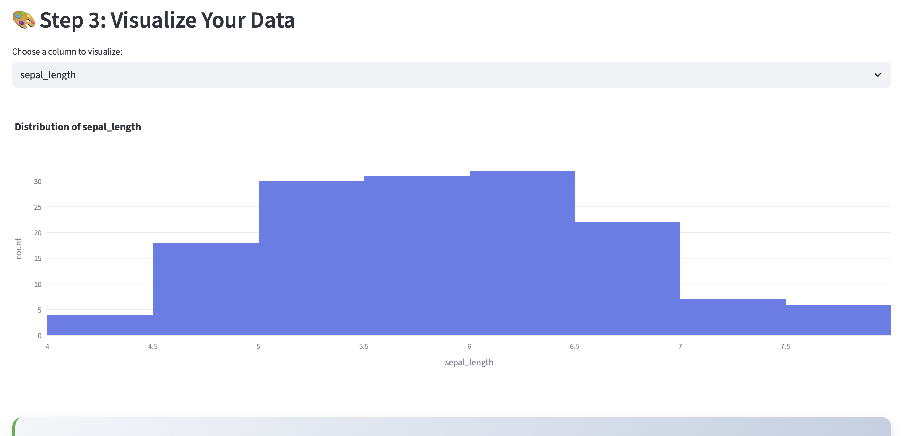
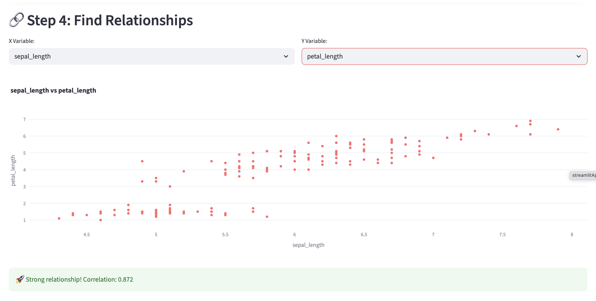
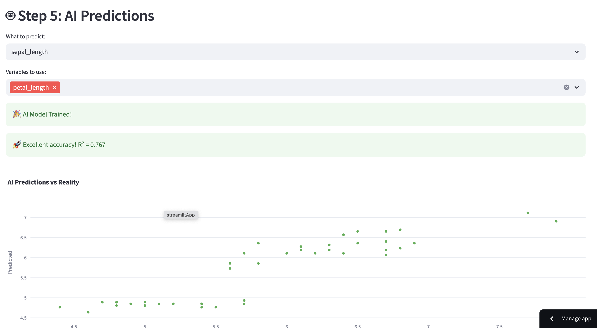
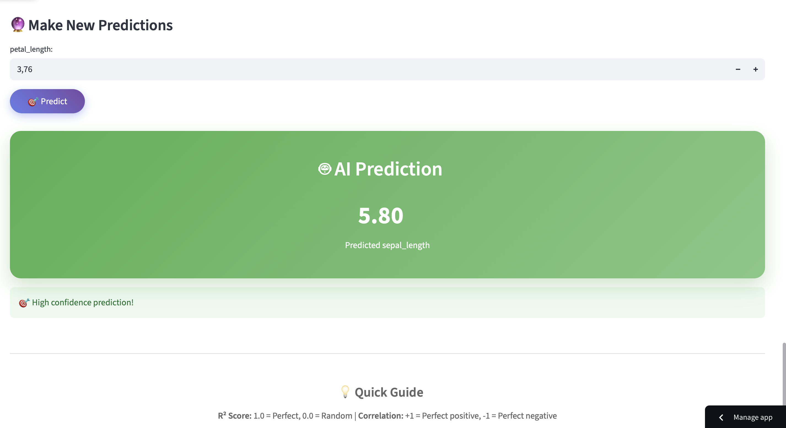
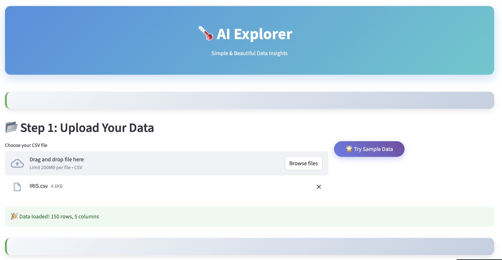

# 🌡️ AI Explorer

**AI Explorer** is an interactive web app designed to help **junior data scientists** explore and analyze datasets with ease. It makes **Exploratory Data Analysis (EDA)** simple: upload a CSV (or use the built-in sample data), visualize trends with beautiful charts, discover relationships between variables, and even train a basic AI model to make predictions. All of this comes in a **clean, user-friendly interface**, making it perfect for learning, experimenting, and showcasing your data science skills.

---

## What You Can Do

### **1. Explore Your Data**
Upload your CSV and instantly see:
- Total rows  
- Total columns  
- Missing values  

---

### **2. Visualize Patterns**
Generate interactive histograms and scatter plots to spot trends and outliers using **Plotly Express**.  

  

---

### **3. Discover Relationships**
Quickly check correlations between numeric features to find strong, moderate, or weak relationships.  

---

### **4. Make Predictions**
Train a **Linear Regression** model and compare predicted vs. actual values. Make new predictions in real-time.  

---

### **5. Try Sample Data**
Don’t have a dataset? Play around with the built-in sample data and explore the app immediately.  

)

---

### **6. Enjoy a Beautiful Interface**
Custom CSS styling keeps the app visually appealing and easy to navigate.  

---

## ⚙️ Tech Stack

- **Python** – Data processing & machine learning  
- **Streamlit** – Interactive UI  
- **Pandas & NumPy** – Data manipulation  
- **Plotly Express** – Interactive visualizations  
- **Scikit-learn** – Machine learning models

---

## Live Demo / Deployment

You can try the app live at:  

- **Streamlit Cloud:** [https://cersei568-ai-explorer-app-app-nciumx.streamlit.app/](https://cersei568-ai-explorer-app-app-nciumx.streamlit.app/)

---