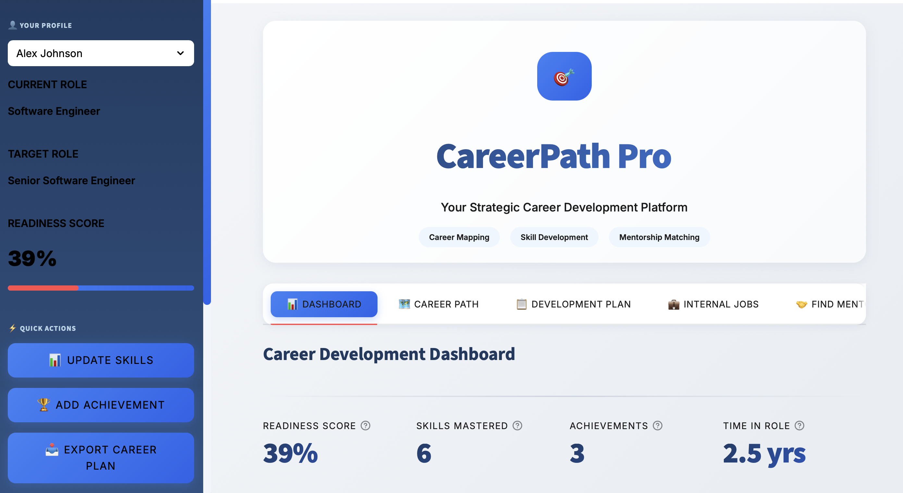
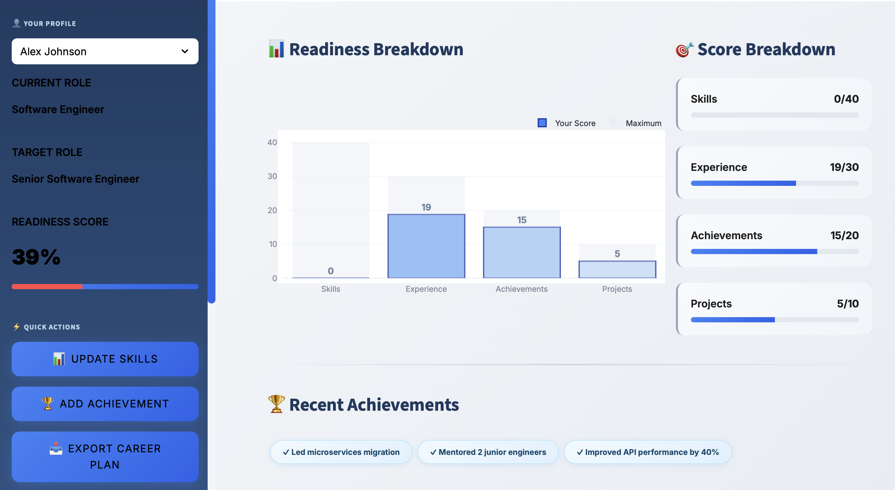
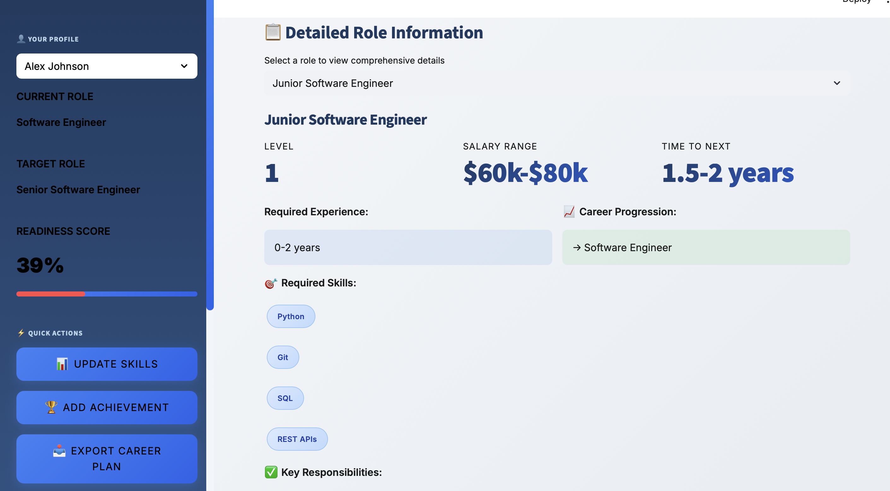
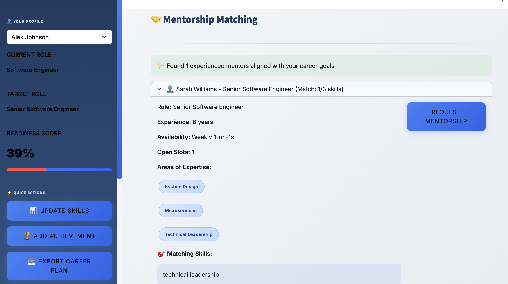

# CareerPath Pro - Strategic Career Development Platform

A comprehensive career development and progression tracking platform that helps employees navigate their career paths, develop required skills, find mentors, and achieve their professional goals through data-driven insights.

## 🔗 Links  

- **Demo:** [Demo](https://careerpathpro.streamlit.app)  
- **GitHub:** [GitHub](https://github.com/cersei568/careerpath_pro)  

## 🌟 Features

### 📊 Career Development Dashboard
- **Readiness Score Calculation**: Multi-factor assessment based on skills, experience, achievements, and projects
- **Progress Tracking**: Visual breakdown of career readiness across four key dimensions
- **Achievement Timeline**: Track and showcase career milestones
- **Project Portfolio**: Document high-impact work and contributions

### 🗺️ Interactive Career Path Visualization
- **Network Graph Mapping**: Visual representation of career progression paths
- **Role Relationships**: See all possible next steps from current position
- **Level-based Hierarchy**: Understand organizational structure (Levels 1-5)
- **Multi-track Paths**: Technical, Management, and Hybrid career tracks
- **Detailed Role Profiles**: Comprehensive information for each role including:
  - Required skills and experience
  - Salary ranges
  - Key responsibilities
  - Typical progression timeline

### 📋 Personalized Development Plans
- **Next Role Recommendations**: AI-driven suggestions based on current profile
- **Skill Gap Analysis**: Identify missing competencies for target roles
- **Action Plan Generator**: Step-by-step roadmap with:
  - Prioritized tasks (High/Medium/Low)
  - Timeline estimates
  - Resource requirements
  - Success probability metrics
- **Career Timeline Visualization**: Projected progression with milestones

### 💼 Internal Job Marketplace
- **Smart Job Matching**: Algorithm-based position recommendations
- **Skills Alignment**: Match percentage calculator
- **Gap Identification**: Clear visibility of missing qualifications
- **Application Tracking**: One-click internal applications

### 🤝 Mentorship Matching System
- **Expertise-based Matching**: Connect with mentors aligned to your goals
- **Availability Tracking**: Real-time mentor capacity information
- **Skill Overlap Analysis**: See matching areas of expertise
- **Request Management**: Streamlined mentorship request process

### 📚 Learning Resources Hub
- **Personalized Recommendations**: Curated learning paths for skill gaps
- **Resource Library**: Courses, books, and training materials
- **Progress Tracking**: Monitor learning journey
- **Integration Ready**: Links to external learning platforms

## 🛠️ Tech Stack

### Core Framework
- **[Streamlit](https://streamlit.io/)** `1.28+` - Interactive web application framework
  - Rapid prototyping and deployment
  - Built-in state management
  - Native Python integration
  - Real-time updates

### Data Processing & Analysis
- **[Pandas](https://pandas.pydata.org/)** `2.0+` - Data manipulation and analysis
  - DataFrame operations for employee data
  - Aggregation and filtering
  - Statistical calculations
  - Data transformation pipelines

### Data Visualization
- **[Plotly](https://plotly.com/python/)** `5.17+` - Interactive charting library
  - `plotly.graph_objects` - Custom chart creation
    - Bar charts for readiness breakdown
    - Scatter plots for career matrices
    - Timeline visualizations
  - `plotly.express` - High-level visualization interface
    - Quick statistical charts
    - Grouped comparisons
- **[NetworkX](https://networkx.org/)** `3.1+` - Network graph analysis
  - Career path graph construction
  - Node and edge relationships
  - Layout algorithms for visualization

### UI/UX
- **Custom CSS** - Professional blue/grey design system
  - Gradient backgrounds
  - Hover animations
  - Responsive layouts
  - Custom components (badges, cards, metrics)
- **[Google Fonts (Inter)](https://fonts.google.com/specimen/Inter)** - Modern typography
  - Variable font weights (300-900)
  - Professional appearance
  - Optimal readability

### Python Standard Library
- **[datetime](https://docs.python.org/3/library/datetime.html)** - Date/time operations
  - Timeline calculations
  - Progress tracking
  - Date formatting
- **[json](https://docs.python.org/3/library/json.html)** - Data serialization
  - Configuration management
  - Data export functionality

## 🚀 Usage

### For Employees

1. **Select Your Profile**
   - Choose your name from the sidebar dropdown
   - View your current role and target role
   - Check your readiness score

2. **Explore Career Paths**
   - Navigate to "Career Path" tab
   - View interactive network graph
   - Click on roles to see detailed information
   - Understand available progression options

3. **Create Development Plan**
   - Go to "Development Plan" tab
   - Review recommended next roles
   - See skill gap analysis
   - Follow prioritized action steps

4. **Find a Mentor**
   - Visit "Find Mentor" tab
   - Browse matched mentors based on your goals
   - Review their expertise and availability
   - Request mentorship connection

5. **Access Learning Resources**
   - Check "Learning Resources" tab
   - View personalized learning paths
   - Access curated courses and materials

### For HR/Managers

1. **Add New Employees**
   - Use the "Add Employee" functionality (can be extended)
   - Input comprehensive employee data
   - System automatically calculates risk scores

2. **Monitor Team Progress**
   - Track readiness scores across team
   - Identify high-potential employees
   - Plan succession and development

3. **Manage Internal Mobility**
   - Post internal job openings
   - Review application matches
   - Facilitate internal transfers

# careerpath_pro
