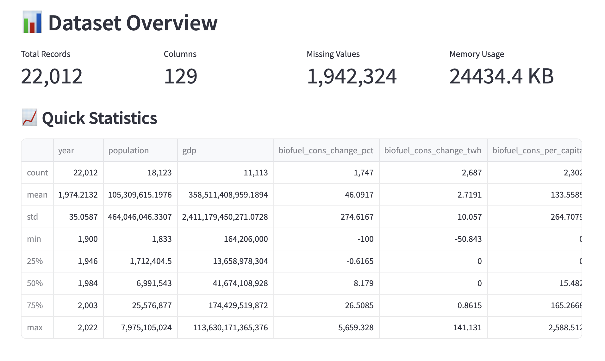
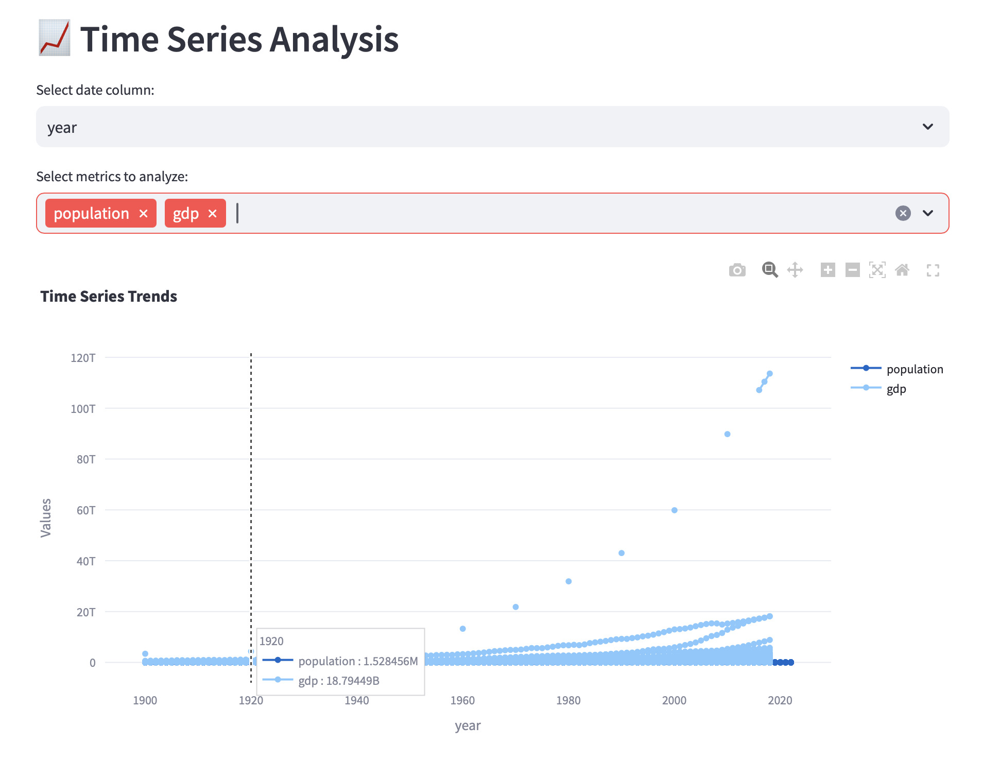
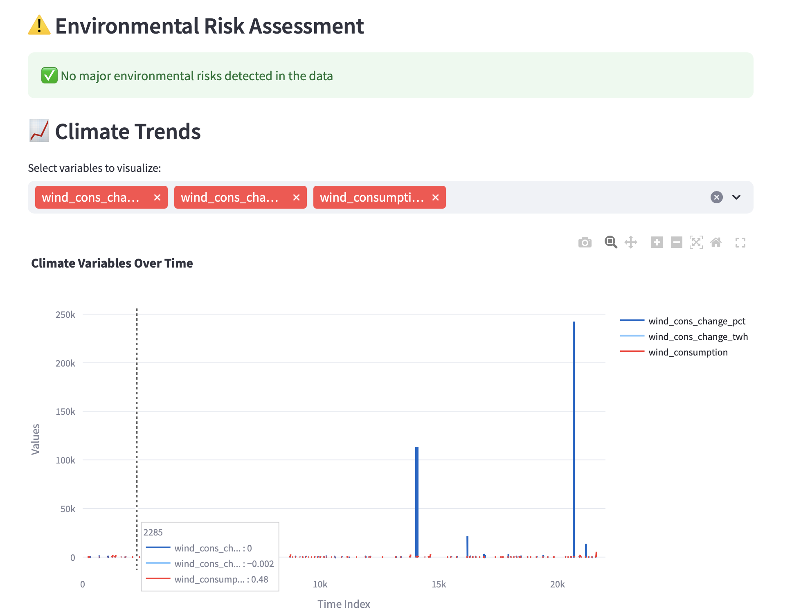

# 🌍 ClimateAI: Environmental Data Analysis Web App

## Project Overview
**ClimateAI** is a beginner-friendly web application that transforms environmental data into actionable insights using machine learning. Built with Python and Streamlit, it demonstrates fundamental data science concepts including data exploration, visualization, correlation analysis, and predictive modeling.

## 🎯 Problem Statement
Environmental scientists and researchers often have CSV files full of climate data but lack easy-to-use tools to:
- Quickly explore and understand their data
- Identify relationships between environmental variables
- Build predictive models without coding
- Generate insights from temperature, air quality, and weather data

## 💡 Solution
I developed a web-based application that automatically:
1. **Loads and cleans** CSV data with smart delimiter detection
2. **Visualizes** data distributions and relationships
3. **Builds AI models** using Random Forest algorithm
4. **Provides predictions** with user-friendly interface

## 🛠️ Technical Implementation

### Core Technologies
- **Python**: Main programming language
- **Streamlit**: Web framework for rapid deployment
- **Pandas**: Data manipulation and analysis
- **Scikit-learn**: Machine learning algorithms
- **Plotly**: Interactive visualizations

👉 **Live Demo**: [Try the App](https://climateai.streamlit.app)  
👉 **Source Code**: [GitHub Repository](https://github.com/cersei568/climate_ai)  

## Preview

  

  

  

  

  

  