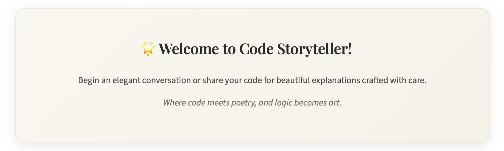
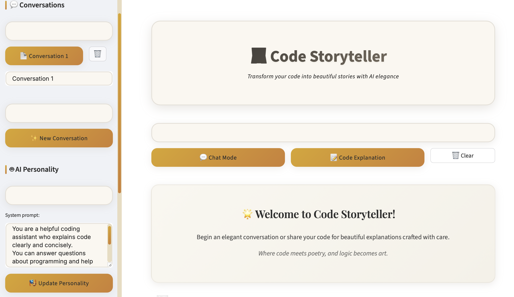
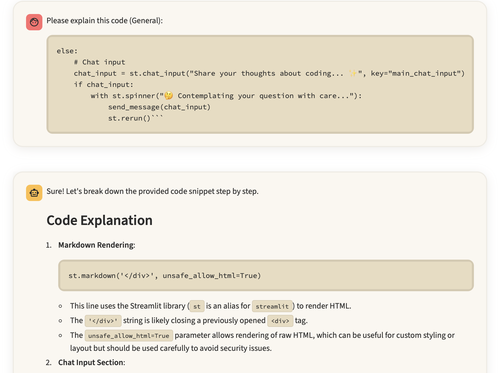

# 💻 Code Storyteller - AI-Powered Code Analysis & Documentation

> "Where code meets poetry, and logic becomes art."

An elegant, production-ready AI application that transforms complex code into beautiful, comprehensible narratives using advanced natural language processing and conversational AI.

---

## 🎯 Project Overview

**Code Storyteller** bridges the gap between complex technical code and human understanding.  
Built with enterprise-grade architecture and modern AI capabilities, it showcases:

- **Large Language Model Integration** (OpenAI GPT-4o-mini)  
- **Full-Stack AI Application Development**  
- **Real-time Conversational AI Systems**  
- **Advanced UI/UX Design with Custom CSS**  
- **Production-Ready Database Management**  
- **Cost-Optimized AI Operations**

---

## 🚀 Key Features & Capabilities

### 🤖 Advanced AI Integration
- **Multi-modal AI Processing**: Text-to-speech, code analysis, and conversational AI  
- **Context-Aware Conversations**: Intelligent context management  
- **Customizable AI Personalities**: Dynamic system prompts  
- **Real-time Cost Tracking**: Token usage monitoring  

### 💼 Enterprise-Grade Architecture
- Secure API Key Management  
- Persistent Data Storage (JSON-based)  
- Scalable Session Management  
- Error Handling & Validation  

### 🎨 Production-Quality UI/UX
- Custom CSS Framework  
- Elegant Beige Theme  
- Advanced Animations  
- WCAG-compliant Accessibility  

### 📊 Data Science & Analytics
- Token Usage Analytics  
- Conversation Metrics  
- Multi-format Data Export  
- Performance Monitoring  

---

## 🛠️ Technical Architecture

### Core Technologies
- **Python 3.8+**
- **Streamlit 1.28+**
- **OpenAI API**
- **JSON, Pathlib**

### AI/ML Components
- GPT-4o-mini
- TTS-1
- Custom Prompts
- Context Management

👉 **Live Demo**: [Try the App](https://codestoryteller.streamlit.app)  
👉 **Source Code**: [GitHub Repository](https://github.com/cersei568/code_storyteller) 

### Screenshots

