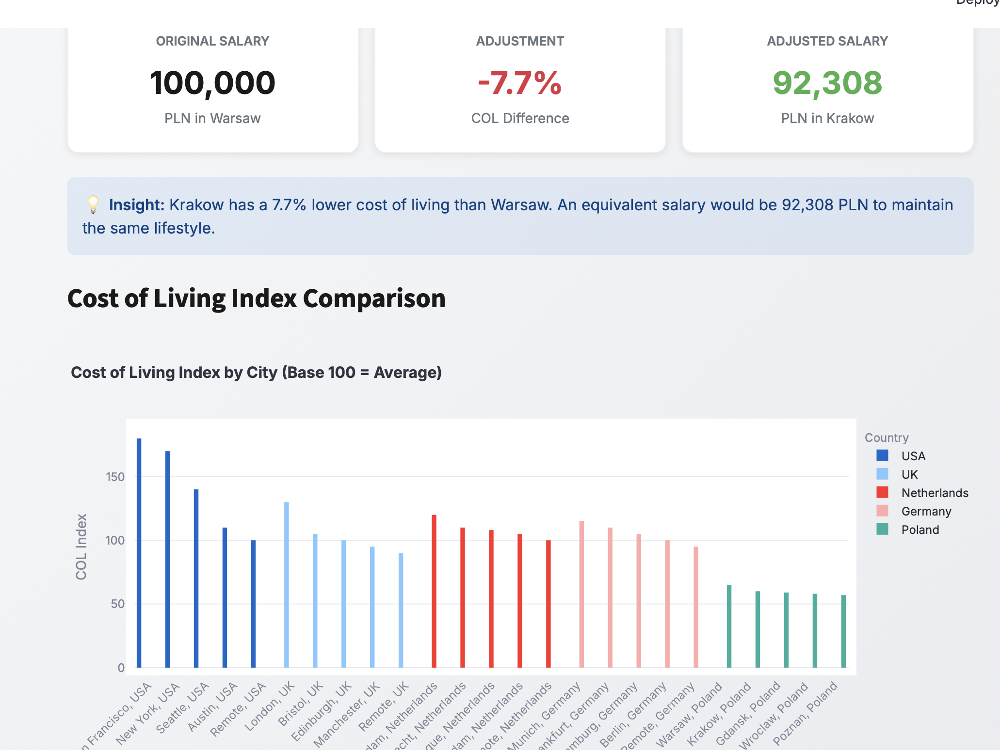

# CompEquity - Global Compensation Benchmarking Platform

A comprehensive compensation benchmarking and pay equity analysis platform for making data-driven salary decisions across global markets.

## 🔗 Links  

- **Demo:** [Demo](https://compequity.streamlit.app)  
- **GitHub:** [GitHub](https://github.com/cersei568/compequity)  

## 🌟 Features

### 📊 Market Benchmarking
- Real-time salary data for 5+ roles across 5 countries
- Multi-currency support (PLN, USD, EUR, GBP)
- Percentile-based market positioning
- Interactive salary distribution visualizations

### ⚖️ Pay Equity Analysis
- Automated gender pay gap detection
- Role-based compensation analysis
- Severity classification (High/Medium)
- Demographic comparison dashboards

### 💼 Offer Negotiation Simulator
- Experience-adjusted recommendations
- Performance-based multipliers
- Competing offer adjustments
- Conservative/Target/Stretch scenarios

### 📈 Salary Band Management
- Four-tier band structure (Junior → Lead)
- Min/Mid/Max ranges per level
- Multi-market band comparisons
- EUR-normalized benchmarking

### 🌍 Cost of Living Calculator
- 25+ cities across 5 countries
- COL index-based adjustments
- Purchasing power equivalency
- Relocation salary recommendations

## 🛠️ Tech Stack

### Core Framework
- **[Streamlit](https://streamlit.io/)** `1.28+` - Web application framework
- **[Python](https://python.org)** `3.8+` - Core programming language

### Data Processing & Analysis
- **[Pandas](https://pandas.pydata.org/)** `2.0+` - Data manipulation and analysis
  - DataFrame operations
  - Data aggregation and filtering
  - Statistical calculations

### Visualization
- **[Plotly](https://plotly.com/python/)** `5.17+` - Interactive charts
  - `plotly.graph_objects` - Custom chart creation
  - `plotly.express` - High-level visualization interface
  - Box plots, bar charts, grouped comparisons

### UI/UX
- **Custom CSS** - Modern gradient design system
- **[Google Fonts (Inter)](https://fonts.google.com/specimen/Inter)** - Typography
- **Responsive Layout** - Mobile-friendly design

### Additional Libraries
- **[datetime](https://docs.python.org/3/library/datetime.html)** - Standard library for date/time operations

## 🚀 Usage

### Quick Start Guide

1. **Market Benchmarking**
   - Select a role and market
   - View min/median/max salary ranges
   - Compare across multiple markets

2. **Pay Equity Analysis**
   - Automatically detects pay gaps
   - Review gender-based compensation disparities
   - Analyze by role and department

3. **Offer Simulator**
   - Input candidate details
   - Get recommended offer ranges
   - See market percentile positioning

4. **Salary Bands**
   - View structured compensation tiers
   - Compare across seniority levels
   - Export for HR systems

5. **COL Calculator**
   - Select origin and target cities
   - Calculate adjusted salaries
   - Plan for relocations

## 📈 Analytics & Insights

### Automated Detection
- **Gender Pay Gap**: Threshold >5% triggers alert
- **Severity Classification**: High (>15%), Medium (5-15%)
- **Market Positioning**: Percentile calculation
- **COL Adjustments**: Real-time calculations

## 🔐 Data Privacy

- All employee data stored in session state
- No external API calls for sensitive data
- Client-side processing only
- No data persistence between sessions

## 📝 License

This project is licensed under the MIT License - see the [LICENSE](LICENSE) file for details.

  <strong>CompEquity</strong> - Make fair, data-driven compensation decisions
   # compequity
