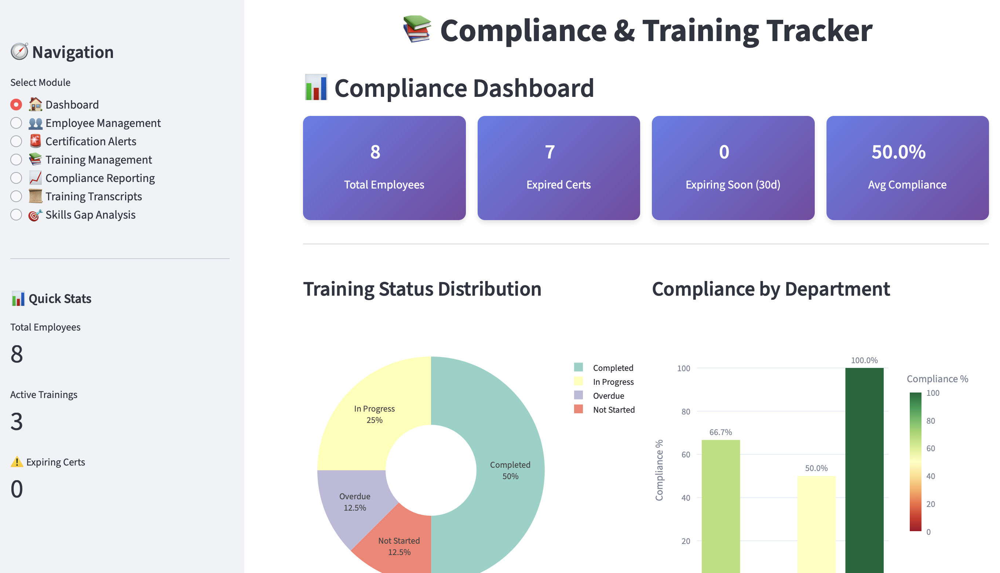
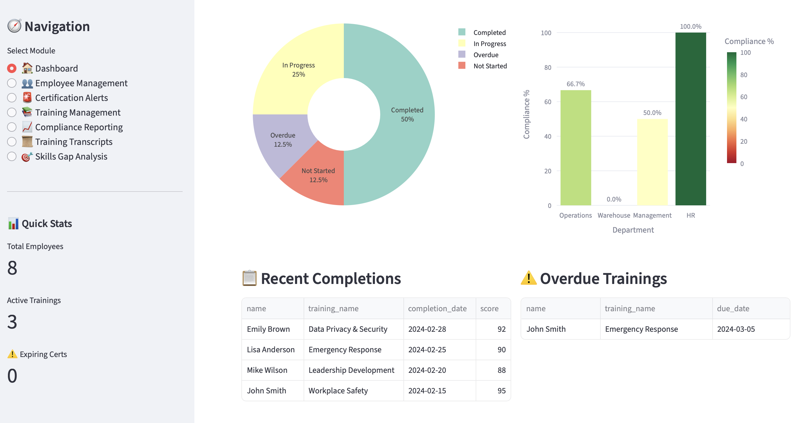
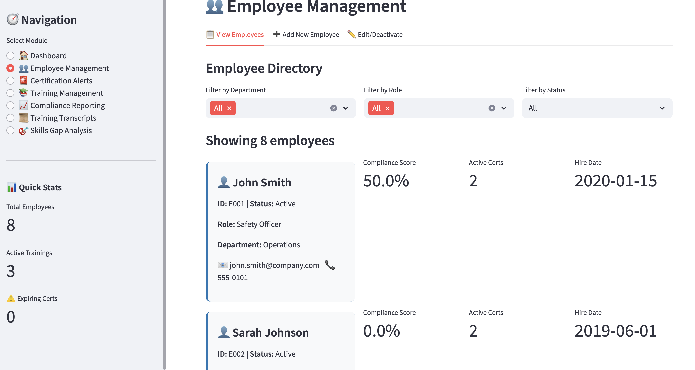
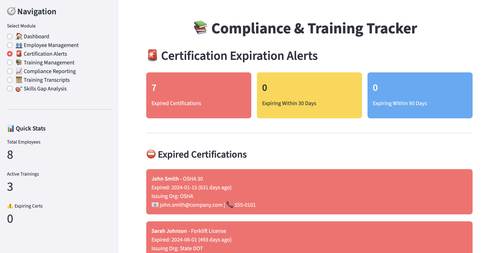
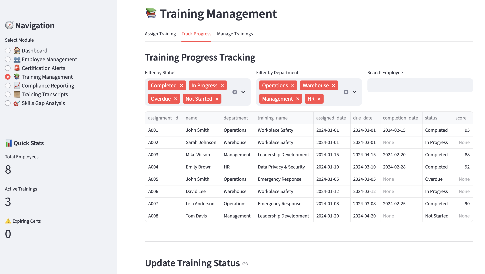
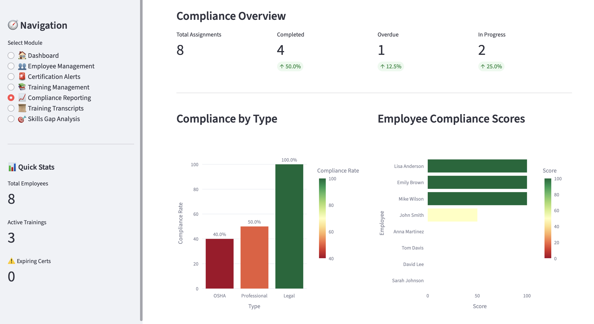
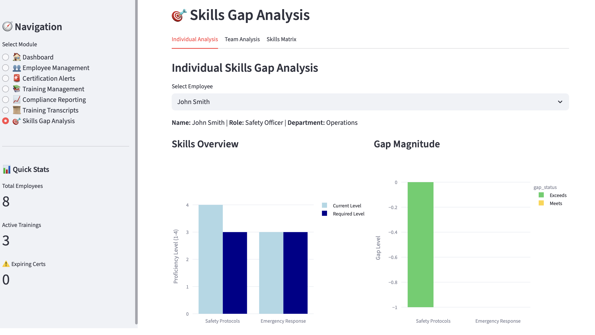

# 📚 Compliance & Training Tracker

A comprehensive web-based application for managing employee training, certifications, compliance reporting, and skills gap analysis.

---

## 🚀 Tech Stack

### Frontend & Framework
- **Streamlit** (v1.28+) – Interactive web application framework  
- **HTML/CSS** – Custom styling and UI components  

### Data Visualization
- **Plotly Express** – Interactive charts and graphs  
- **Plotly Graph Objects** – Advanced visualizations and gauges  

### Data Management
- **Pandas** (v2.0+) – Data manipulation and analysis  
- **Python** (v3.8+) – Core programming language  

### File Handling
- **xlsxwriter** – Excel file generation and export  
- **BytesIO** – In-memory file handling  

### Additional Libraries
- **datetime** – Date and time operations  
- **json** – Data serialization  

---

## ✨ Features

### 1. Dashboard
- Real-time compliance metrics  
- Training status distribution visualization  
- Department-level compliance tracking  
- Recent activity monitoring  
- Overdue training alerts  

### 2. Employee Management
- Complete employee directory with filtering  
- Add, edit, and deactivate employees  
- Auto-assignment of mandatory trainings  
- Individual compliance scoring  
- CSV export functionality  

### 3. Certification Alerts
- Expired certification tracking  
- 30-day and 90-day expiration warnings  
- Bulk email reminder system  
- Certification management (add/edit)  
- Contact information for quick follow-up  

### 4. Training Management
- Individual and bulk training assignment  
- Role-based automatic assignment  
- Progress tracking and status updates  
- Training catalog management  
- Completion scoring system  

### 5. Compliance Reporting
- Full compliance overview reports  
- Detailed analytics with time series  
- Department and employee comparisons  
- Multiple export formats (CSV, Excel)  
- Customizable date ranges  

### 6. Training Transcripts
- Individual employee training history  
- Certification records  
- Compliance score calculation  
- Excel and PDF export options  
- Comprehensive employee profiles  

### 7. Skills Gap Analysis
- Individual skills assessment  
- Team-level gap analysis  
- Skills matrix management  
- Visual gap representation  
- Development recommendations  
- Bulk assessment tools  

## 🎥 Demo

🔗 **Live Demo:** [Compliance & Training Tracker](https://compliancetrainingtracker.streamlit.app)

