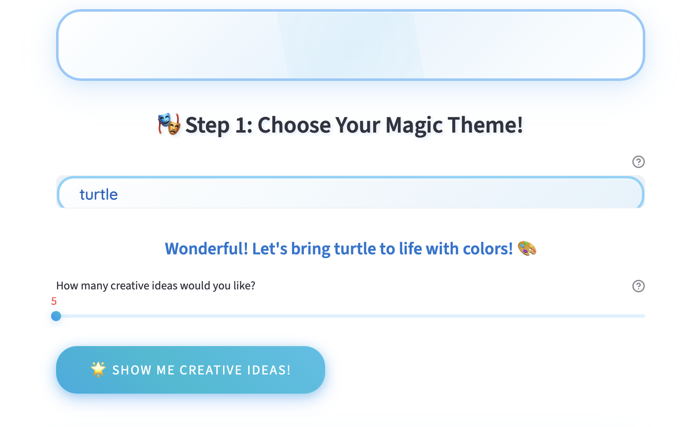

# 🎨 Dream Canvas Studio 🌈

**Dream Canvas Studio** is an AI-powered application that creates magical, kid-friendly coloring pages.  
Built with **Streamlit** and **OpenAI APIs**, it transforms creative themes into **black-and-white line-art illustrations** perfect for coloring.

---

## Features
- 🔑 **Secure API key handling** (environment variables, Streamlit secrets, or user input)  
- 🎭 **Creative Theme Ideas** – GPT generates imaginative prompts for kids  
- 🖼️ **AI Coloring Page Generation** – DALL·E creates unique line-art images  
- 💾 **Gallery Management** – Save, view, and download your artwork  
- 🎨 **Custom Design System** – Baby-blue themed UI with animations, gradients, and shadows  

---

## 🛠️ Tech Stack
- Python 3.10+  
- Streamlit  
- OpenAI API (GPT + DALL·E)  
- Requests  
- JSON / UUID  

---

👉 **Try it live here:** [Streamlit App Deployment](https://dreapcanvasstudio.streamlit.app)  
👉 **Source code on GitHub:** [Repository Link](https://github.com/cersei568/dream_canvas_studio)  

---

## Screenshots

 

---

