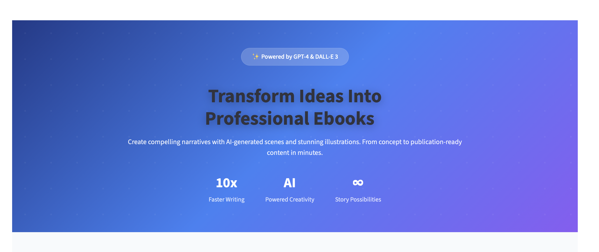
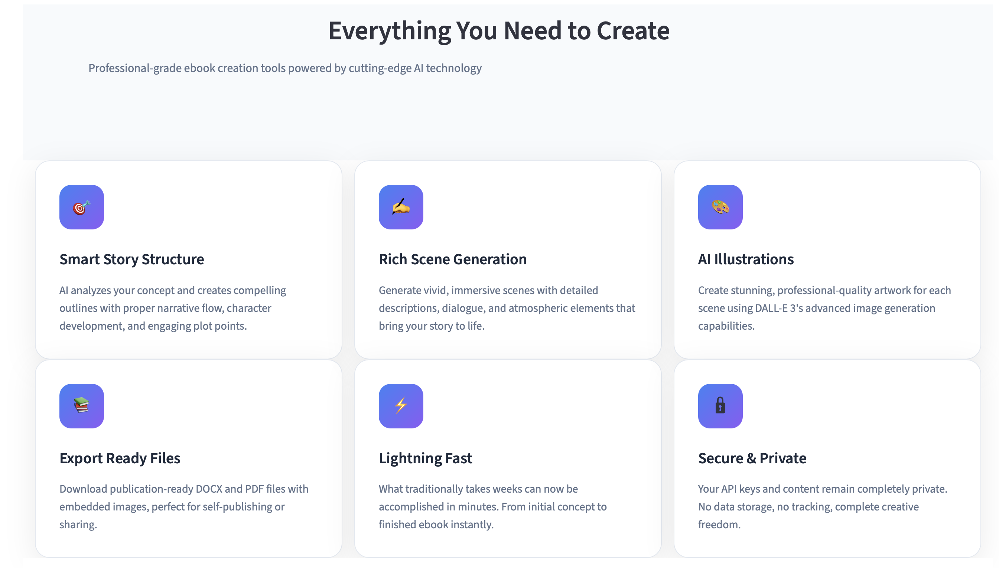

# 📖 Ebook Writer AI

## Introduction

The **Ebook Writer AI** is an intelligent writing assistant built with **Streamlit**, designed to help creators bring stories to life.  
From **generating titles and outlines** to **expanding scenes and creating illustrations**, it combines the power of **GPT-4** and **DALL·E 3** into a seamless storytelling pipeline.

👉 **Live Demo**: [Try the App](https://ebookwriter.streamlit.app/)  
👉 **Source Code**: [GitHub Repository](https://github.com/cersei568/ebook_writer)  

⚠️ Note: You’ll need your own **OpenAI API key** to run the app.

---

## Key Features

- 📝 **AI-Generated Titles & Outlines** – Start your ebook with structured guidance.  
- 📖 **Scene Expansion** – Turn outlines into vivid, detailed chapters.  
- 🎨 **AI-Powered Illustrations** – Generate custom artwork for each scene.  
- 📦 **Export Options** – Download complete ebooks in **DOCX** or **PDF** format.  

---

## Tech Stack

- **Frontend/UI:** Streamlit + Custom CSS  
- **AI Models:** OpenAI GPT-4 (text) & DALL·E 3 (images)  
- **File Exports:** python-docx, ReportLab  
- **Data Handling:** Requests, BytesIO  
- **Languages:** Python 3.9+  

---

## Preview

  
 
  

  

  

  

  

  

  

---
