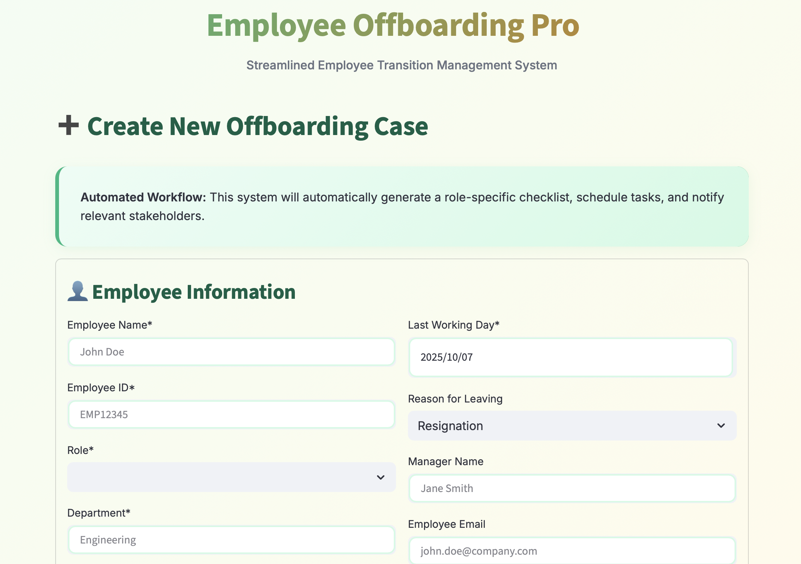
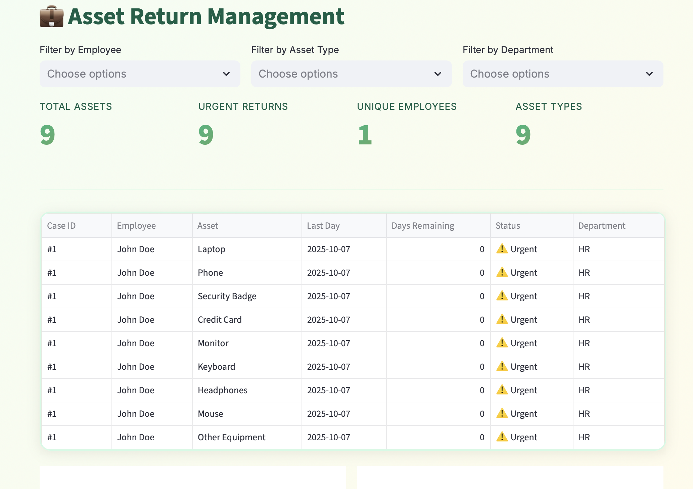

# Employee Offboarding Pro

A comprehensive, automated employee offboarding management system designed to streamline the employee exit process, ensure compliance, and maintain organizational security.

## 🔗 Links  

- **Demo:** [Demo](https://employeeoffboarding.streamlit.app)  
- **GitHub:** [GitHub](https://github.com/cersei568/employee_offboearding_pro)  

## 🚀 Tech Stack

### Core Framework
- **Streamlit** - Modern web application framework
- **Python 3.8+** - Core programming language

### Data Management
- **Pandas** - Data manipulation and analysis
- **JSON** - Data persistence and configuration

### Visualization
- **Plotly Express** - Interactive charts and graphs
- **Plotly Graph Objects** - Advanced visualizations
  - Pie charts, bar charts, line graphs
  - Custom color schemes and layouts

### Additional Libraries
- **datetime** - Date and time management
- **io.BytesIO** - File handling and exports

## ✨ Key Features

### 1. Dashboard
- Real-time offboarding case overview
- Active cases monitoring
- Completion rate tracking
- Urgent case alerts
- Visual analytics with charts
- Department and role breakdowns

### 2. New Offboarding Creation
- Role-specific automated checklists
- Asset tracking configuration
- System access inventory
- Customizable workflows
- Automatic task scheduling
- Stakeholder notifications

### 3. Active Case Management
- Task checklist with progress tracking
- Category-based task organization
- Due date monitoring
- Priority indicators (Critical, High, Normal)
- Real-time completion percentage
- Overdue task alerts
- Responsible party assignment
- Quick actions (complete, export, remind)

### 4. Asset Return Tracking
- Complete asset inventory
- Multi-level filtering (employee, asset type, department)
- Return status monitoring
- Visual analytics by asset type
- Export capabilities
- Urgent return alerts

### 5. System Access Management
- Comprehensive access revocation workflow
- Grouped by system categories
- One-click revocation
- Progress tracking per employee
- Security compliance monitoring
- Critical access alerts

### 6. Exit Interview Management
- **Schedule**: Calendar integration, reminders
- **Conduct**: Structured questionnaire with 9 key questions
- **Analysis**: Satisfaction metrics, recommendation rates, tenure analysis
- Data visualization and insights
- Common themes identification
- Export functionality

### 7. Final Compensation Calculator
- Detailed paycheck breakdown
- Components:
  - Regular pay calculation
  - Unused PTO payout
  - Severance pay
  - Bonuses and commissions
  - Stock options
  - Expense reimbursements
- Deductions tracking
- Tax estimation (simplified)
- Downloadable payment summary

### 8. Analytics & Insights
- Key performance indicators
- Department analysis
- Role-based statistics
- Reason for leaving trends
- Completion rate analytics
- Exit interview correlation
- Exportable reports

### 9. Settings Management
- General system configuration
- Notification preferences
- Automated report scheduling
- Email integration setup
- Timezone and date format

## 📋 Role-Based Checklists

Pre-configured checklists for:
- **Software Engineer** (11 tasks)
- **Sales Representative** (10 tasks)
- **HR Manager** (10 tasks)
- **Finance Manager** (10 tasks)
- **Marketing Specialist** (9 tasks)
- **Product Manager** (7 tasks)
- **Operations Manager** (6 tasks)

Each checklist includes:
- Task description
- Category (Asset Return, Access Revocation, Knowledge Transfer, Administrative)
- Due date (days before last working day)
- Responsible party
- Priority level

## 🔒 System Access Categories

Organized access management for:
- **Core Systems**: Email, Slack/Teams, VPN, Building Access
- **Development**: GitHub/GitLab, AWS/Azure/GCP, CI/CD, Docker/Kubernetes
- **Business Applications**: CRM, HRIS, Payroll, ERP
- **Productivity Tools**: Project Management, Document Management
- **Communication**: Phone System, Video Conferencing
- **Finance**: Accounting Software, Banking Systems
- **Marketing**: Social Media, Marketing Automation, Design Tools

## 📈 Analytics & Reporting

### Available Metrics
- Total offboarding cases
- Active vs. completed cases
- Average completion percentage
- Department distribution
- Reasons for leaving
- Role-based analytics
- Exit interview satisfaction scores
- Recommendation rates
- Average employee tenure

### Export Options
- CSV exports for all data tables
- Individual case reports
- Asset tracking lists
- Exit interview data
- Payment summaries
- Full analytics dataset

## 🔔 Alerts & Notifications

### Automatic Alerts
- Cases with 3 or fewer days remaining
- Overdue tasks highlighted in red
- Urgent asset returns
- Critical access not yet revoked
- Low completion percentages

### Notification System (Configurable)
- Manager notifications on case creation
- HR notifications for new cases
- IT notifications for access revocation
- Automated reminders before due dates
- Weekly summary reports
- Monthly analytics reports

## 🎯 Best Practices

### For HR/Admin
1. Create offboarding case immediately upon resignation
2. Use standard notice period (14 days default)
3. Schedule exit interview 2-3 days before last day
4. Review completion percentage daily
5. Ensure 100% completion before archiving

### For Managers
1. Prioritize knowledge transfer tasks
2. Schedule handover meetings early
3. Document critical information
4. Review and approve completed tasks
5. Conduct thorough exit interview

### For IT
1. Revoke critical access on last working day
2. Document all access revocations
3. Return and wipe company devices
4. Archive employee data per policy
5. Update system records

### For Security
1. Collect all physical access items
2. Deactivate building access on last day
3. Update security systems
4. Document asset returns
5. Report any missing items

## 🔐 Security & Compliance

### Data Protection
- Session-based data storage
- No permanent database (resets on restart)
- Suitable for internal networks

### Compliance Features
- Complete audit trail
- Task documentation
- Exit interview records
- Access revocation logs
- Asset return tracking

### For Production Use
- Implement user authentication
- Add role-based access control (RBAC)
- Integrate with HR systems (Workday, BambooHR)
- Connect to IT systems (Active Directory)
- Set up email notifications (SMTP)
- Implement database (PostgreSQL/MySQL)
- Add audit logging
- Enable data encryption
- Configure automated backups

## 💡 Tips & Tricks

1. **Quick Navigation**: Use sidebar radio buttons for fast page switching
2. **Filtering**: Use multi-select filters to focus on specific cases
3. **Exports**: Download CSV reports for offline analysis
4. **Batch Operations**: Use role-based assignment for multiple employees
5. **Urgent Cases**: Check dashboard alerts for priority items
6. **Progress Tracking**: Monitor completion percentages in real-time

## 📄 License

Internal use only. Proprietary software.

