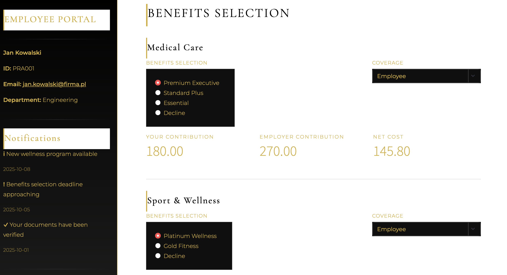

# 💼 Benefits Selection Assistant - Professional Pastel Theme

A modern, professional employee benefits selection portal built with Streamlit, featuring a sophisticated pastel color scheme with high-contrast text for optimal readability.

  

👉 Try the app: **[Demo Link (Streamlit)](https://benefits.streamlit.app)**  
👉 Explore the code: **[GitHub Repository](https://github.com/cersei568/benefits_enrollment_assistant)**  

## 🌟 Features

### Core Functionality
- **Interactive Benefits Selection**: Choose from medical, sports, and insurance packages
- **Employee Dashboard**: Real-time overview of selected benefits and costs
- **Dependent Management**: Add and verify family members for coverage
- **Cost Calculator**: Dynamic pricing based on coverage tiers
- **Document Management**: Upload and download benefit-related documents
- **PPK Integration**: Employee retirement savings plan configuration

### Design Highlights
- **Professional Pastel Theme**: Soft, modern color palette with purple accents
- **High Contrast Text**: Ensures excellent readability (WCAG compliant)
- **Responsive Layout**: Adapts to different screen sizes
- **Smooth Animations**: Subtle hover effects and transitions
- **Modern UI Components**: Cards, badges, and gradient effects

### Benefit Plans

The application includes three categories of benefits:

1. **Medical Plans** (Pakiety Medyczne)
   - Premium: 350 PLN/month
   - Standard: 200 PLN/month
   - Basic: 120 PLN/month

2. **Sports Packages** (Pakiety Sportowe)
   - Multisport Plus: 150 PLN/month
   - Multisport Basic: 80 PLN/month

3. **Life Insurance** (Ubezpieczenie)
   - Life + Health: 100 PLN/month

### Coverage Tiers

Each benefit can be extended to cover:
- Employee only (1.0x multiplier)
- Employee + Partner (1.8x multiplier)
- Employee + Children (1.6x multiplier)
- Family (2.3x multiplier)

## 🖥️ User Interface Sections

### 1. Dashboard (Pulpit)
- Status overview cards
- Selected benefits summary
- Cost breakdown
- Quick statistics

### 2. Comparison (Porównanie)
- Side-by-side plan comparison
- Dynamic pricing based on coverage
- Detailed feature lists
- Recommended options

### 3. Benefits Selection (Wybór Benefitów)
- Interactive selection forms
- Real-time cost updates
- PPK configuration
- Enrollment confirmation

### 4. Dependents (Osoby Zależne)
- Add family members
- Document verification status
- Manage dependent information

### 5. Documents (Dokumenty)
- Download plan documents
- Upload verification files
- Document categories

## 🛡️ Security Considerations

- **Session State**: All user data is stored in Streamlit's session state
- **No Database**: Current version uses in-memory storage
- **Input Validation**: Basic validation for form inputs
- **PESEL Protection**: Only last 4 digits displayed

## 📄 License

This project is licensed under the MIT License - see the [LICENSE](LICENSE) file for details.

