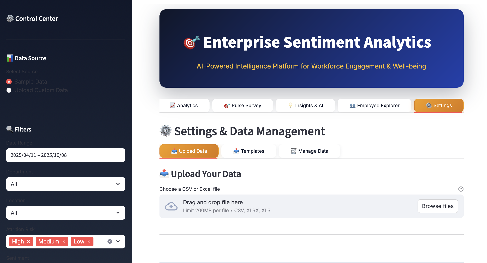
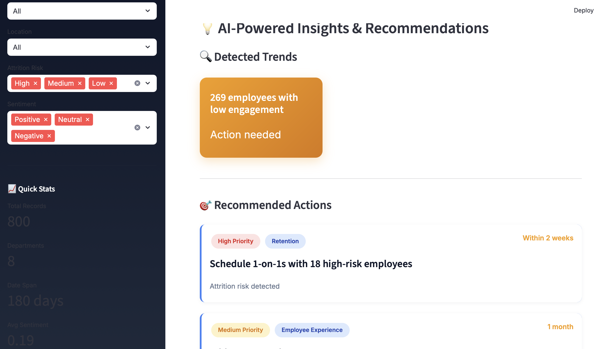
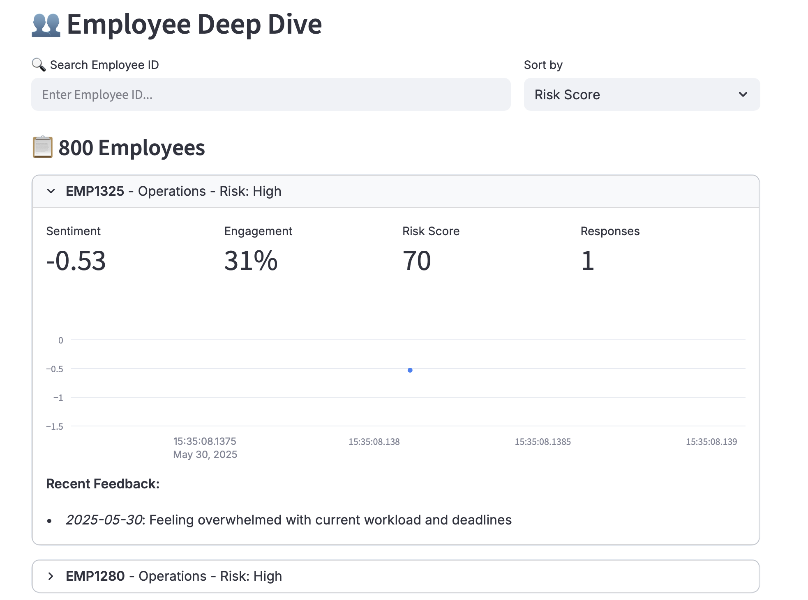
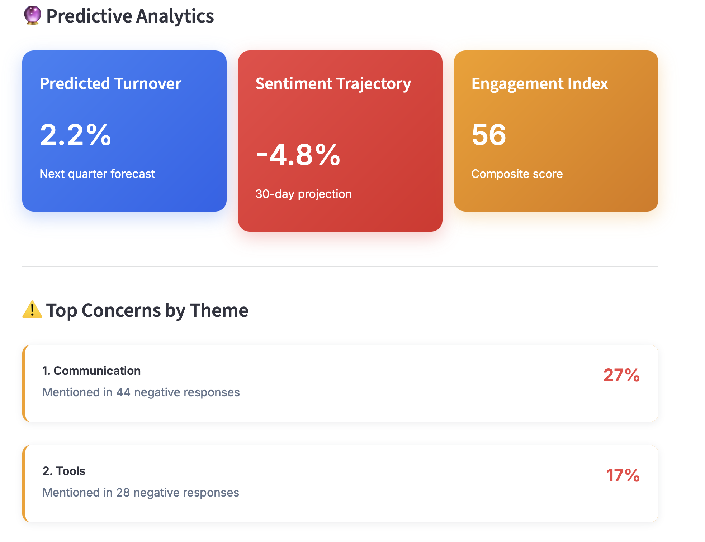

# 🎯 Enterprise Sentiment Analytics Platform

**AI-Powered Intelligence Platform for Workforce Engagement & Well-being**

[Features](#-features) • [Demo](#-demo) • [Usage](#-usage)
</div>



## 📖 Overview

Enterprise Sentiment Analytics is a comprehensive, production-ready platform designed to help HR teams and organizational leaders gain deep insights into employee sentiment, engagement, and well-being. Leveraging advanced natural language processing and predictive analytics, this platform transforms employee feedback into actionable intelligence.

### 🎥 Demo

> **Live Demo:** [Try it now](https://employeesentimentmonitor.streamlit.app)

---







---


## ✨ Features

### 📊 **Executive Dashboard**
- **Real-time Metrics**: Track sentiment score, engagement, NPS, and attrition risk
- **Trend Visualization**: Interactive time-series charts with confidence intervals
- **Department Analytics**: Compare performance across teams and locations
- **Risk Assessment**: Identify high-risk employees before they leave
- **Response Tracking**: Monitor participation rates and feedback coverage

### 📈 **Advanced Analytics**
- **Correlation Analysis**: Discover relationships between engagement factors
- **Multi-dimensional Insights**: Scatter plots and heat maps
- **Time Series Deep Dive**: Historical trends with statistical analysis
- **Keyword Mining**: Automatic topic extraction from feedback
- **Cohort Analysis**: Segment by tenure, role, location, and department

### 🎯 **Pulse Surveys**
- **Quick Check-ins**: 2-minute employee pulse surveys
- **5 Core Dimensions**: Satisfaction, balance, recognition, workload, growth
- **Anonymous Options**: Encourage honest feedback
- **Real-time Results**: Instant aggregation and visualization
- **Survey History**: Track pulse trends over time

### 💡 **AI-Powered Insights**
- **Automated Trend Detection**: Machine learning identifies patterns
- **Smart Recommendations**: Prioritized action items with timelines
- **Predictive Analytics**: Forecast turnover and sentiment trajectories
- **Theme Analysis**: Identify top concerns across feedback
- **Engagement Index**: Composite scoring across multiple factors

### 👥 **Employee Deep Dive**
- **Individual Profiles**: Track sentiment history per employee
- **Risk Scoring**: Multi-factor attrition risk assessment
- **Search & Filter**: Find employees by ID, department, or risk level
- **Feedback Timeline**: Chronological view of all responses
- **Personalized Insights**: Tailored recommendations per employee

### ⚙️ **Data Management**
- **Flexible Import**: Support for CSV and Excel formats
- **Template System**: Pre-built templates for easy data formatting
- **Data Quality Metrics**: Completeness, recency, and coverage tracking
- **Export Capabilities**: Download filtered data and comprehensive reports
- **Privacy Controls**: Anonymization and data retention settings

---

## 🛠️ Tech Stack

### **Core Framework**
- **[Streamlit](https://streamlit.io/)** `v1.32.0` - Interactive web application framework
- **[Python](https://www.python.org/)** `v3.8+` - Primary programming language

### **Data Processing & Analysis**
- **[Pandas](https://pandas.pydata.org/)** `v2.2.0` - Data manipulation and analysis
- **[NumPy](https://numpy.org/)** `v1.26.4` - Numerical computing and array operations
- **[OpenPyXL](https://openpyxl.readthedocs.io/)** `v3.1.2` - Excel file handling

### **Natural Language Processing**
- **[TextBlob](https://textblob.readthedocs.io/)** `v0.18.0` - Sentiment analysis and NLP
- **NLTK** - Natural language toolkit (TextBlob dependency)

### **Data Visualization**
- **[Plotly](https://plotly.com/python/)** `v5.19.0` - Interactive charts and graphs
  - Line charts with confidence intervals
  - Scatter plots with bubble sizing
  - Heat maps for correlation analysis
  - Radar charts for multi-dimensional metrics
  - Pie charts and donut charts
  - Horizontal and vertical bar charts

### **Additional Libraries**
- **datetime** - Date and time manipulation
- **collections.Counter** - Frequency counting for keyword analysis
- **io.BytesIO** - In-memory file handling for exports
- **json** - JSON data serialization
- **random** - Sample data generation

### **Architecture Highlights**
```
┌─────────────────────────────────────┐
│      Streamlit Web Interface        │
├─────────────────────────────────────┤
│   Session State Management Layer    │
├─────────────────────────────────────┤
│        Data Processing Layer        │
│  ├─ Sentiment Analysis (TextBlob)   │
│  ├─ Keyword Extraction              │
│  ├─ Risk Scoring Algorithm          │
│  └─ Engagement Index Calculation    │
├─────────────────────────────────────┤
│      Visualization Layer            │
│  └─ Plotly Interactive Charts       │
├─────────────────────────────────────┤
│       Data Storage Layer            │
│  ├─ Session State (Runtime)         │
│  ├─ CSV/Excel Import                │
│  └─ Export Engine                   │
└─────────────────────────────────────┘
```
---

## 💻 Usage

### **1. Getting Started**

#### **Option A: Use Sample Data**
- Open the application
- Sample data (800+ records) loads automatically
- Explore all features immediately

#### **Option B: Upload Your Data**
- Navigate to **Settings → Upload Data**
- Download a template (Feedback, Pulse, or Sentiment)
- Format your data according to template
- Upload CSV or Excel file
- Click "Process & Import"

### **2. Navigation Guide**

#### **📊 Dashboard Tab**
View high-level metrics and trends:
```
- Overall sentiment score with trend indicator
- Engagement percentage across organization
- Net Promoter Score (NPS)
- High-risk employee count
- Response rate tracking
```

#### **📈 Analytics Tab**
Deep dive into data relationships:
```
- Correlation matrix of engagement factors
- Department vs sentiment scatter plot
- Risk distribution by employee tenure
- Time series analysis with confidence bands
- Topic and keyword frequency analysis
```

#### **🎯 Pulse Survey Tab**
Conduct quick employee surveys:
```
1. Employee enters ID (optional for anonymity)
2. Selects department
3. Rates 5 core dimensions (1-10)
4. Provides optional text feedback
5. Submits and views real-time results
```

#### **💡 Insights & AI Tab**
Access AI-powered recommendations:
```
- Automated trend detection
- Prioritized action items
- Predictive turnover forecasting
- Sentiment trajectory predictions
- Top concern identification
```

#### **👥 Employee Explorer Tab**
Individual employee analysis:
```
- Search by employee ID
- Sort by risk, sentiment, or engagement
- View personal sentiment trends
- Review feedback history
- Export individual reports
```

#### **⚙️ Settings Tab**
Manage data and configuration:
```
- Upload custom datasets
- Download data templates
- Export current views
- Configure thresholds
- Set notification preferences
- Manage data retention
```

### **3. Data Format Requirements**

#### **Minimum Required Columns**
```csv
date,department,feedback_text
2024-01-15,Engineering,"Great team collaboration"
2024-01-16,Sales,"Need better CRM tools"
```

#### **Full Schema (Optional Columns)**
```csv
date,employee_id,department,location,role,channel,feedback_text,engagement_score,sentiment_score
2024-01-15,EMP1001,Engineering,New York,Senior,Survey,"Great collaboration",85,0.75
```

### **4. Key Metrics Explained**

| Metric | Description | Range | Interpretation |
|--------|-------------|-------|----------------|
| **Sentiment Score** | Overall emotional tone | -1.0 to 1.0 | <-0.1 Negative, >0.1 Positive |
| **Engagement Score** | Employee involvement | 0-100% | <50% Low, >80% High |
| **NPS Score** | Net Promoter Score | -100 to 100 | <0 Poor, >50 Excellent |
| **Risk Score** | Attrition probability | 0-100 | <25 Low, >50 High |
| **Engagement Index** | Composite wellness | 0-100 | Multiple factors combined |

---

## 📈 Performance

### **Benchmarks**
| Dataset Size | Load Time | Memory Usage | Response Time |
|--------------|-----------|--------------|---------------|
| 500 records  | <1s       | 150MB        | <100ms        |
| 5,000 records| <3s       | 300MB        | <200ms        |
| 50,000 records| <10s     | 800MB        | <500ms        |

### **Optimization Tips**
- Use date filters to reduce data volume
- Enable data sampling for very large datasets
- Export and archive historical data regularly
- Use categorical filters before time-series analysis

---

## 🔒 Security & Privacy

### **Data Protection**
- ✅ No data stored on external servers
- ✅ All processing done locally
- ✅ Session-based storage (cleared on exit)
- ✅ Optional employee ID anonymization
- ✅ Configurable data retention policies

### **Best Practices**
1. Use anonymous surveys for sensitive topics
2. Aggregate data before sharing (dept level)
3. Restrict access to individual employee data
4. Regular data exports with encryption
5. Comply with GDPR/privacy regulations

---

## 📄 License

This project is licensed under the MIT License - see the [LICENSE](LICENSE) file for details.

---

<div align="center">

**Made with ❤️ for better workplaces**

[⬆ Back to Top](#-enterprise-sentiment-analytics-platform)

</div>