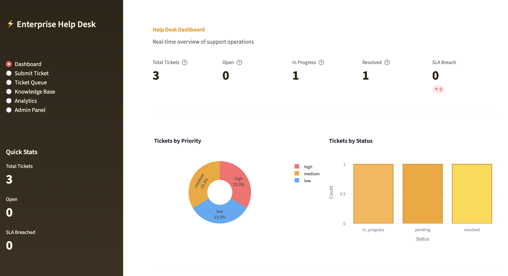
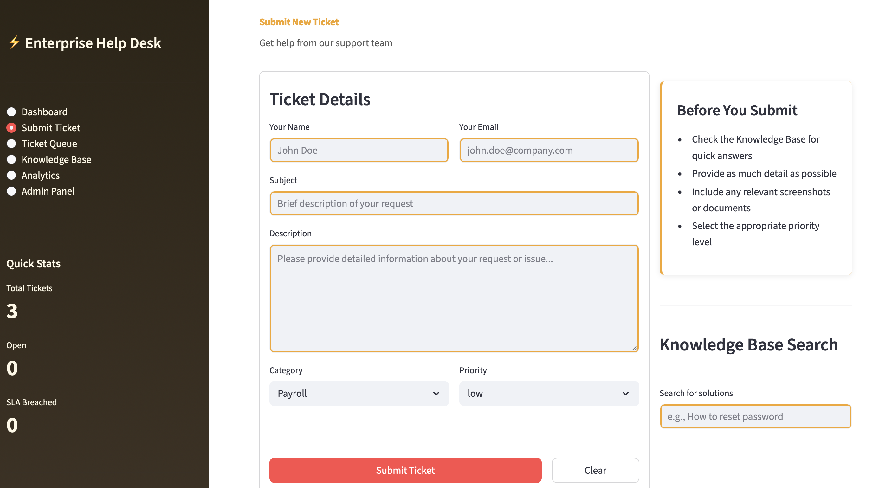
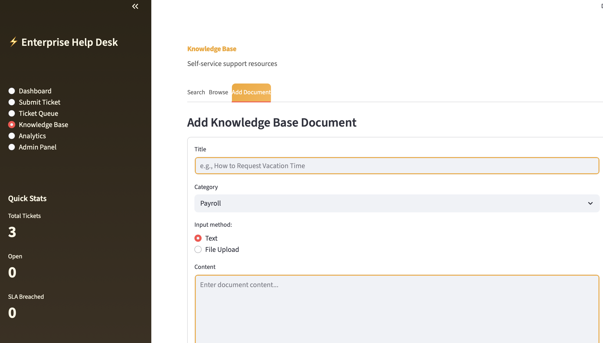
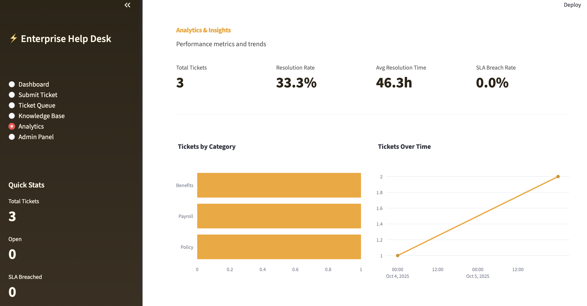
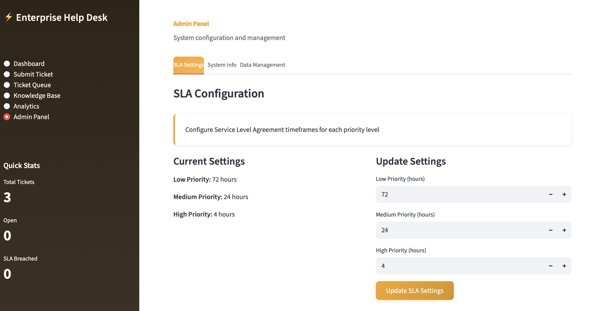

# Enterprise Help Desk System

 

A professional, full-featured internal help desk application with ticket management, knowledge base, SLA tracking, and analytics.

👉 Try the app: **[Demo Link (Streamlit)](https://enterprisedesk.streamlit.app)**  
👉 Explore the code: **[GitHub Repository](https://github.com/cersei568/internal_help_desk)**  

## Tech Stack

### Core Framework
- **Streamlit** - Interactive web application framework
- **Python 3.8+** - Core programming language

### Data Management
- **SQLite3** - Embedded relational database
- **Pandas** - Data manipulation and analysis

### Machine Learning & Search
- **scikit-learn** - TF-IDF vectorization and similarity search
  - TfidfVectorizer - Text feature extraction
  - linear_kernel - Similarity calculations

### Visualization
- **Plotly Express** - Interactive charts
- **Plotly Graph Objects** - Advanced visualizations
  - Pie charts, bar charts, line graphs
  - Custom color schemes and layouts

### Document Processing
- **PyMuPDF (fitz)** - PDF text extraction (optional)

### Additional Libraries
- **uuid** - Unique identifier generation
- **datetime** - Timestamp handling
- **os** - File system operations

## Features

### 1. Dashboard
- Real-time ticket metrics
- Priority distribution visualization
- Status breakdown charts
- Recent activity feed
- SLA breach alerts
- Quick action buttons

### 2. Ticket Management
- Submit new tickets with priority levels
- Automatic SLA calculation
- Status tracking (open, in progress, pending, resolved, closed)
- Ticket assignment
- Comment threading
- Resolution notes
- Email notifications (structure in place)

### 3. Knowledge Base
- AI-powered semantic search using TF-IDF
- Document categorization
- Text and PDF upload support
- Browse by category
- Relevance scoring
- Self-service support

### 4. SLA Tracking
- Priority-based SLA targets
  - High: 4 hours
  - Medium: 24 hours
  - Low: 72 hours
- Automatic breach detection
- Real-time countdown timers
- Visual alerts for at-risk tickets

### 5. Analytics & Reporting
- Resolution rate metrics
- Average resolution time
- SLA breach rate
- Category distribution
- Tickets over time
- Priority breakdown
- Export to CSV

### 6. Admin Panel
- SLA configuration
- System information
- Database management
- Data export
- Bulk operations

## Usage Guide

### Submitting a Ticket

1. Navigate to "Submit Ticket"
2. Fill in required fields:
   - Your name
   - Email address
   - Subject line
   - Detailed description
   - Category
   - Priority level
3. Click "Submit Ticket"
4. Note your ticket ID for tracking

### Managing Tickets

1. Go to "Ticket Queue"
2. Use filters to find specific tickets
3. Select a ticket to view details
4. Add comments or update status
5. Assign to team members
6. Add resolution notes

### Using Knowledge Base

**Search:**
1. Navigate to "Knowledge Base" → "Search"
2. Enter keywords or questions
3. Review results ranked by relevance

**Browse:**
1. Go to "Browse" tab
2. Filter by category
3. Expand articles to read

**Add Documents:**
1. Select "Add Document" tab
2. Enter title and category
3. Either type content or upload file
4. Submit to knowledge base

### Viewing Analytics

1. Go to "Analytics"
2. Review KPI metrics at top
3. Analyze charts for trends
4. Export data using the detailed table

## Performance

- Handles 10,000+ tickets efficiently
- Sub-second search response times
- Optimized SQL queries with indexing
- In-memory data processing with Pandas
- Efficient TF-IDF vectorization

## License

Internal use only. Proprietary software.

---

 

 

 

 

**Version:** 2.0  
**Last Updated:** October 2024  
**Status:** Production Ready  
**Maintained by:** Cersei568