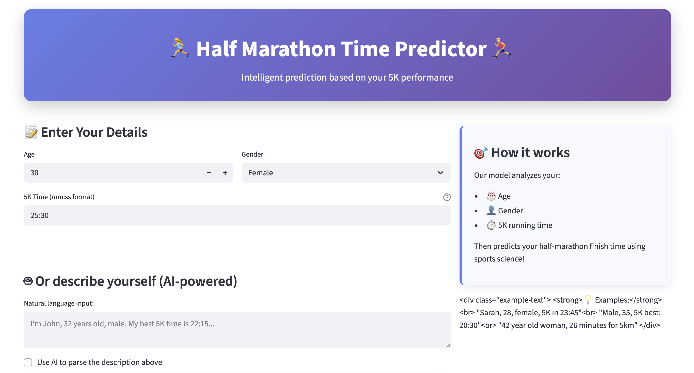
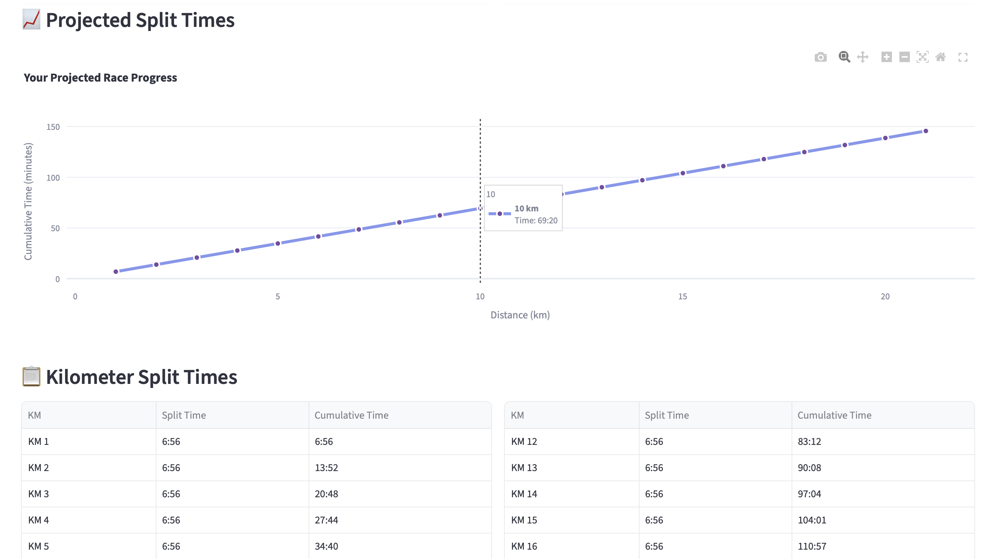

# 🏃‍♀️ Half Marathon Time Predictor 🏃‍♂️  

  

An **AI-powered web app** that predicts your **half marathon finish time** based on your **5K performance, age, and gender**.  
The app combines a **machine learning model**, **statistical fallback formulas**, and **natural language input parsing** using **OpenAI GPT models**.  

👉 Try the app: **[Demo Link (Streamlit)](https://halfmarathonapp.streamlit.app)**  
👉 Explore the code: **[GitHub Repository](https://github.com/cersei568/half_marathon_app)**  

---

## 📸 Screenshots  

### Main Interface  
 

### Prediction Results  
 

### Split Times Table & Visualization  
 

---

## 🧑‍💻 Tech Stack  

- **Frontend/UI**: [Streamlit](https://streamlit.io/) with custom CSS styling  
- **Machine Learning**: Pre-trained regression model (`.pkl`), fallback statistical model  
- **Data Handling**: [Pandas](https://pandas.pydata.org/)  
- **Visualization**: [Plotly](https://plotly.com/python/) interactive charts & tables  
- **AI & NLP**: [OpenAI GPT](https://platform.openai.com/) for parsing user inputs  
- **Experiment Tracking**: [Langfuse](https://langfuse.com/) for tracing and logging model performance  
- **Environment Management**: Python `dotenv` for API keys and configuration  

---

## 🚀 Features  

✅ **Predict half marathon finish time** using:  
- Age  
- Gender  
- 5K running time  

✅ **Two prediction modes**:  
- **ML Model** (trained regression)  
- **Statistical fallback model** when ML model isn’t available  

✅ **Interactive Results Dashboard**:  
- Animated **prediction card**  
- Extracted personal info (age, gender, pace)  
- **Split times table** (per KM)  
- **Interactive Plotly chart** showing projected progress  

✅ **Smart Input Parsing**:  
- Accepts **free text input** (e.g., *“I’m Sarah, 28, female, 5K in 23:45”*)  
- Extracts structured info using **OpenAI GPT** + regex fallback  

✅ **Beautiful UI**:  
- Custom CSS for cards, animations, and layout  
- Easy-to-use **Streamlit interface**  

---