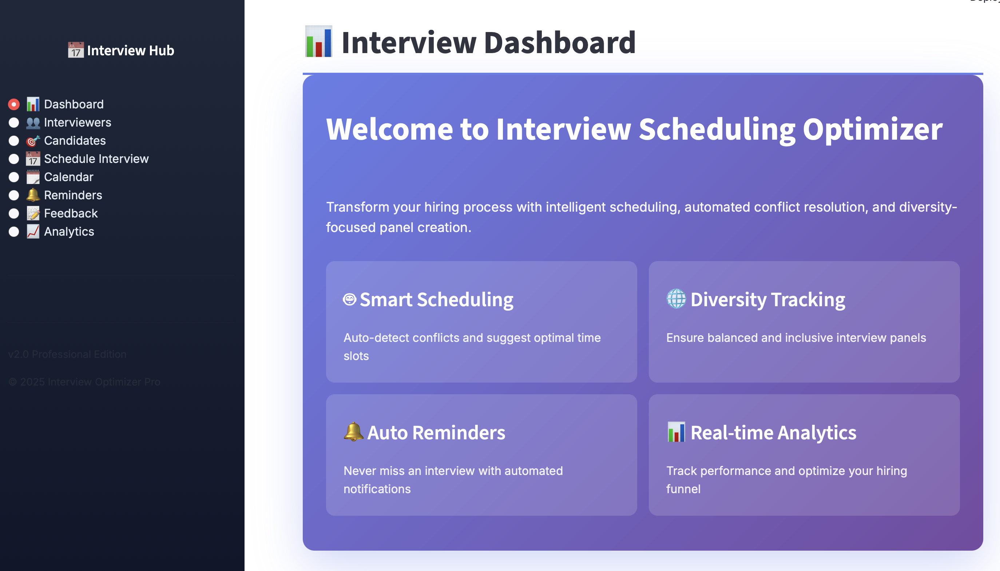
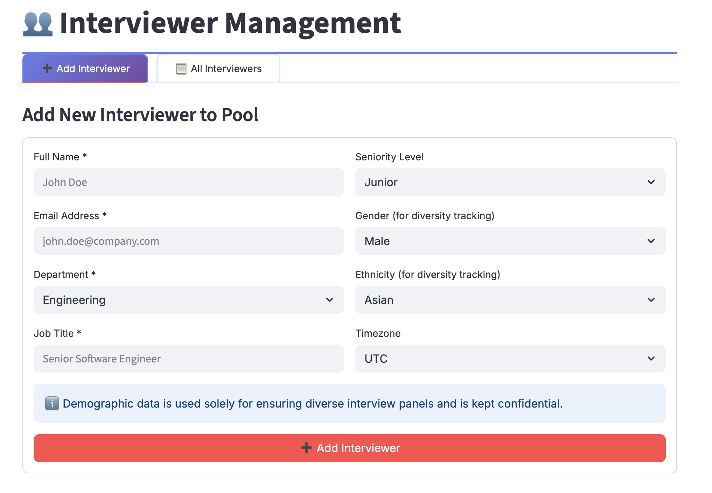
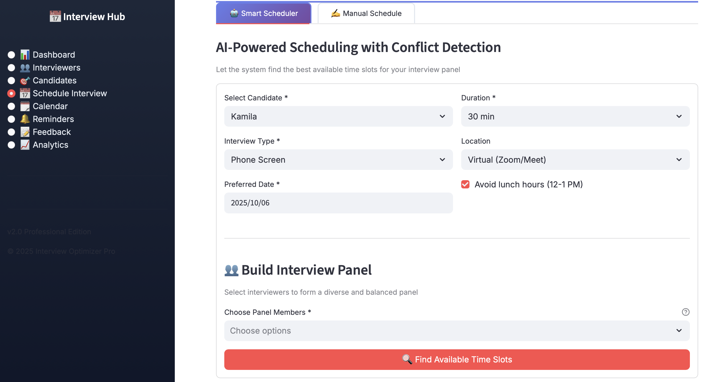
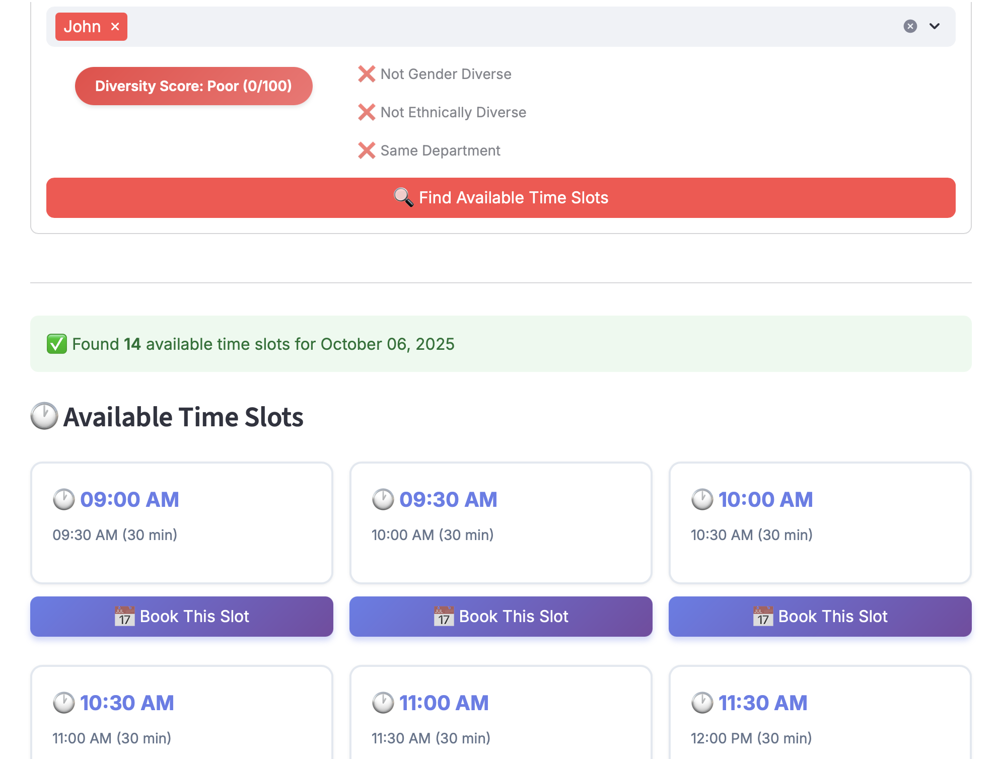
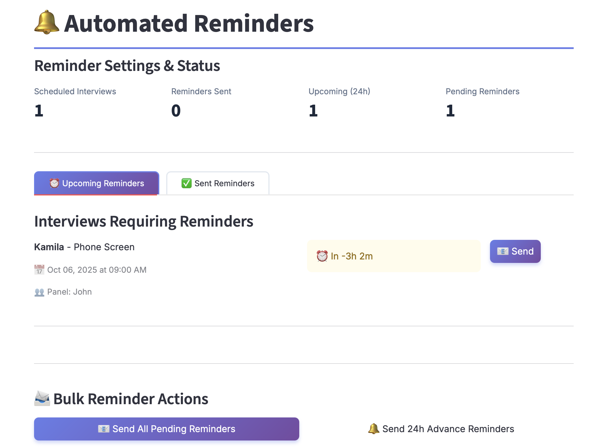
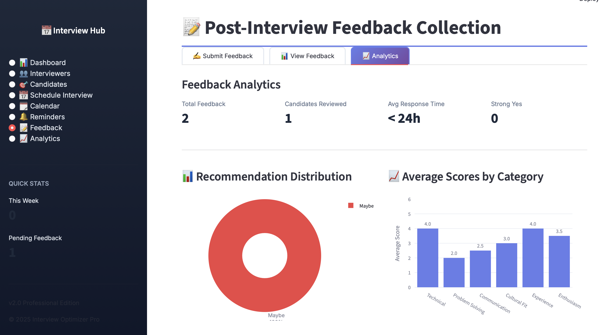
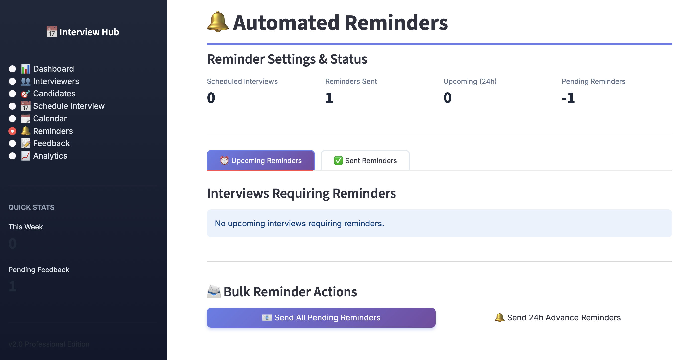
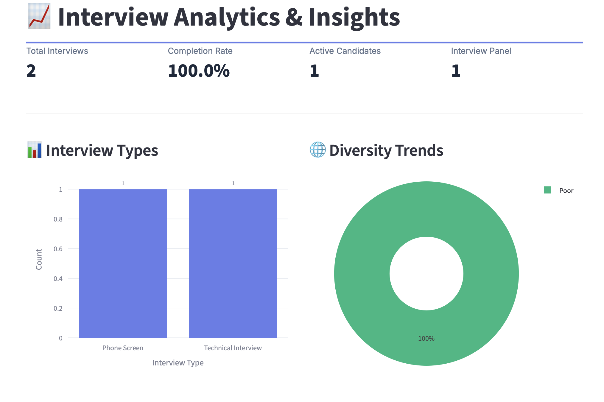

# Interview Scheduling Optimizer

A comprehensive, AI-powered interview scheduling and management system built with Streamlit that streamlines the hiring process with intelligent conflict detection, diversity tracking, and automated workflows.

## 🎥 Demo

🔗 **Live Demo:** [Interview Scheduling Optimizer](https://interviewscheduling.streamlit.app)

## 🚀 Features

### Core Functionality
- **Smart Scheduling**: AI-powered scheduling with automatic conflict detection
- **Diversity Tracking**: Real-time diversity scoring for interview panels
- **Automated Reminders**: Email and calendar notifications for participants
- **Feedback Collection**: Structured post-interview evaluation system
- **Analytics Dashboard**: Real-time insights into hiring pipeline and performance

### Key Highlights
- 🤖 **Intelligent Conflict Resolution** - Automatically detects scheduling conflicts
- 🌐 **Diversity & Inclusion** - Ensures balanced interview panels
- 📊 **Real-time Analytics** - Track pipeline metrics and interviewer performance
- 🔔 **Automated Notifications** - Never miss an interview
- 📝 **Comprehensive Feedback** - Structured evaluation framework
- 📅 **Calendar Integration** - Visual scheduling with conflict indicators

## 🛠️ Tech Stack

### Core Technologies
- **[Python](https://www.python.org/)** (3.8+) - Primary programming language
- **[Streamlit](https://streamlit.io/)** - Web application framework
- **[Pandas](https://pandas.pydata.org/)** - Data manipulation and analysis
- **[Plotly](https://plotly.com/)** - Interactive data visualizations

### UI/UX
- **Custom CSS** with Google Fonts (Inter)
- **Gradient designs** and modern card layouts
- **Responsive grid system**
- **Interactive components** (forms, tabs, expanders)

## 🎯 Usage Guide

### 1. Dashboard Overview
- View key metrics and upcoming interviews
- Monitor diversity scores across interview panels
- Track candidate pipeline stages

### 2. Interviewer Management
- Add interviewers with demographic information
- Track interview load and availability
- Monitor feedback submission rates

### 3. Candidate Tracking
- Add candidates with application details
- Track progress through interview stages
- Maintain notes and communication history

### 4. Smart Scheduling
- **Auto-Scheduler**: AI finds optimal time slots
- **Manual Scheduler**: Custom time selection with conflict warnings
- **Diversity Scoring**: Real-time panel composition feedback
- **Conflict Detection**: Automatic identification of scheduling issues

### 5. Calendar View
- Visual representation of scheduled interviews
- Day-by-day breakdown
- Quick actions (complete, cancel, reschedule)

### 6. Reminders System
- Automated email notifications
- Bulk reminder actions
- 24-hour advance warnings
- Reminder history tracking

### 7. Feedback Collection
- Structured evaluation forms
- Multi-criteria scoring system
- Aggregate candidate assessments
- Analytics and insights

