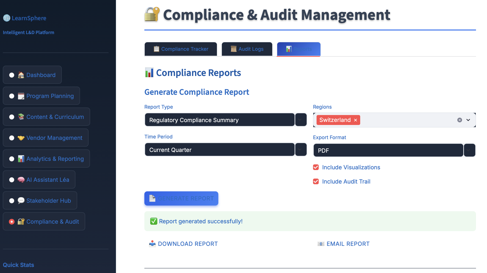

# 🌐 LearnSphere - Intelligent Learning & Development Platform

**From strategy to impact — one intelligent workspace for L&D leaders.**

LearnSphere is an enterprise-grade Learning & Development management platform designed to help L&D Program Managers design, execute, and evaluate corporate learning initiatives across multilingual, regulated environments.

👉 Try the app: **[Demo Link (Streamlit)](https://learnsphere.streamlit.app)**  
👉 Explore the code: **[GitHub Repository](https://github.com/cersei568/learnsphere_l-d_programme_manager)**  

---

## 🎯 Core Purpose

LearnSphere integrates **planning, content creation, vendor collaboration, learner analytics, and reporting** into one AI-driven ecosystem, specifically designed for:

- 🏢 **Enterprise L&D Teams** managing multiple learning programs
- 🌍 **Multinational Organizations** requiring multilingual content
- 🔐 **Regulated Industries** (Banking, Finance, Healthcare) with compliance requirements
- 📊 **Data-Driven Leaders** who need actionable insights and ROI metrics

---

## ✨ Key Features

### 🗓️ **Program Planning & Roadmapping**
- Visual Gantt chart for yearly learning roadmap
- AI-assisted planning based on business goals and regulatory cycles
- Automated scheduling with milestone tracking
- Program tagging by skill area, audience, and geography

### 📚 **Content & Curriculum Design Hub**
- Built-in course designer for modular learning paths
- AI translation assistant for multilingual content (German, English, French, Italian, Polish)
- Version control and regulatory approval workflows
- SME collaboration tools

### 🤝 **Vendor & Partner Management**
- Comprehensive vendor database with ratings and performance history
- Contract and SLA management
- Real-time collaboration with content providers
- Budget tracking and cost optimization analytics

### 📊 **Advanced Analytics & Reporting**
- Real-time KPI dashboards (completion rates, satisfaction, cost per learner, ROI)
- AI-powered Learning Impact Analyzer
- Dynamic reports exportable to PowerPoint, Excel, Tableau
- Automated compliance reports by region/language

### 🧠 **AI Assistant "Léa"**
- Personalized learning recommendations
- Sentiment analysis of feedback and surveys
- Performance gap identification
- Multi-language communication drafting

### 💬 **Stakeholder Communication Hub**
- Role-based dashboards (HR, Business Managers, Compliance, Finance)
- Automated update digests
- Integration-ready for Outlook/Teams
- Collaboration feeds and decision tracking

### 🔐 **Compliance & Audit Mode**
- Complete traceability log of all decisions
- Automated certification reminders
- Secure access levels for partners
- Regulatory content templates

### 🌍 **Global & Multilingual Capabilities**
- Real-time translation and localization
- Regional dashboards for multiple countries
- Multi-language content review workflows
- Time zone and holiday-aware scheduling

---

## 💡 Key Capabilities

### For L&D Program Managers
- ✅ Reduce administrative work by **50%** through automation
- ✅ Unified view of all learning initiatives
- ✅ Budget optimization recommendations
- ✅ Real-time program performance tracking

### For Compliance Officers
- ✅ Complete audit trail of all activities
- ✅ Automated regulatory training tracking
- ✅ Certification management
- ✅ Regional compliance reporting

### For Finance Controllers
- ✅ Budget vs. spend analysis
- ✅ Cost per learner metrics
- ✅ ROI calculation tools
- ✅ Vendor spend optimization

### For Business Leaders
- ✅ Strategic skill gap analysis
- ✅ Learning impact on business metrics
- ✅ Executive dashboards
- ✅ Predictive analytics

---

## 📊 Sample Use Cases

### 1. **Financial Services Compliance Training**
A multinational bank needs to deliver mandatory compliance training to 5,000+ employees across Switzerland, Germany, and Poland in multiple languages.

**LearnSphere Solution:**
- Create program with multilingual content
- Track completion rates by region
- Generate audit-ready compliance reports
- Monitor certification status in real-time

### 2. **Leadership Development Program**
Roll out a 6-month leadership program for 200 senior managers with multiple learning modules and assessments.

**LearnSphere Solution:**
- Design modular curriculum with dependencies
- Schedule cohort-based learning paths
- Track progress and engagement
- Calculate ROI based on retention and performance

### 3. **Vendor Content Management**
Manage relationships with 10+ content vendors and optimize spending across multiple programs.

**LearnSphere Solution:**
- Centralized vendor database
- Performance tracking and ratings
- Contract management
- Cost analysis and optimization recommendations

---

### Customization

The platform can be customized for your organization:
- **Branding**: Update logo and colors in CSS
- **Languages**: Add new languages in translation hub
- **Metrics**: Configure custom KPIs in analytics
- **Integrations**: Connect to existing LMS/HRIS systems

---

## 📝 License

This project is licensed under the MIT License - see the [LICENSE](LICENSE) file for details.

---

Built with ❤️ for L&D professionals worldwide
Transforming corporate learning, one program at a time.

# learnsphere_l-d_programme_manager
