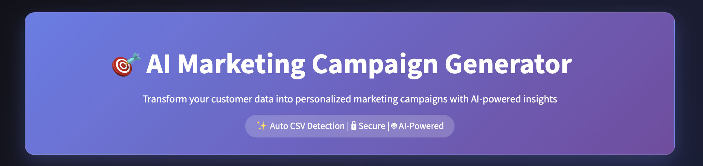
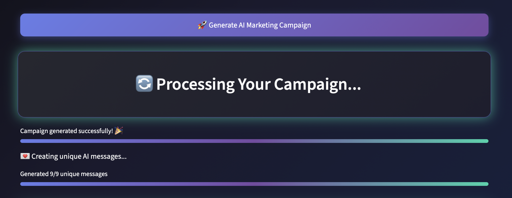
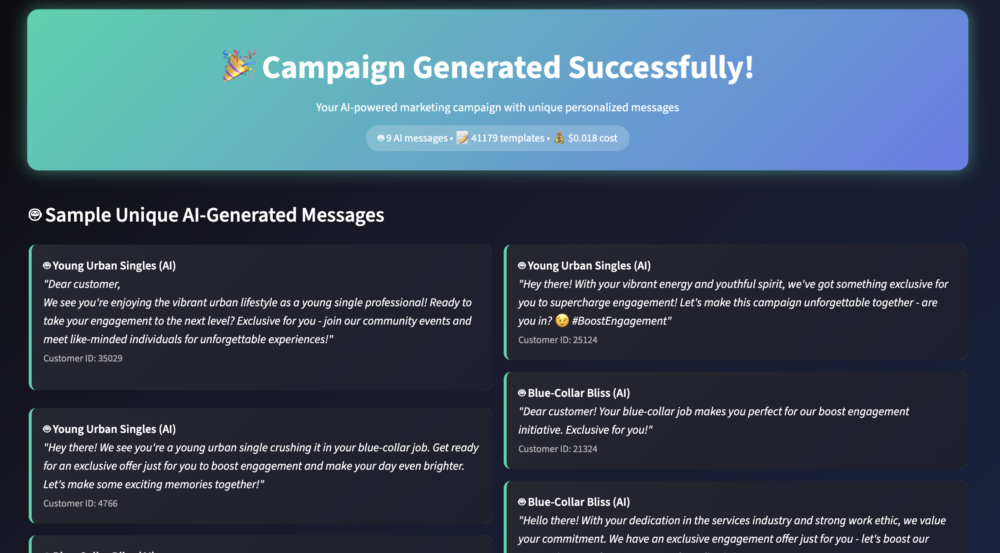
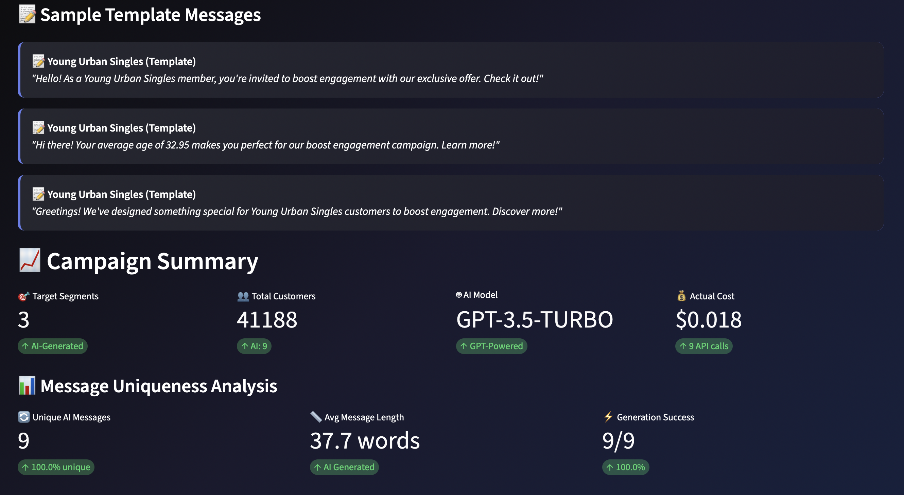

# 📊 AI-Powered Marketing Campaign Generator  

## Turning data into personalized strategies.
 

## Overview  
An end-to-end **Data Science and AI solution** that transforms raw customer datasets into **personalized marketing campaigns**.  

This project demonstrates the full **data science lifecycle**:  
- Data preprocessing and feature engineering  
- Customer segmentation with clustering  
- Predictive analytics to estimate customer spending/charges  
- AI-driven campaign message generation  
- Deployment as an interactive **Streamlit app**  

---

## Key Features  
- **Customer Segmentation** – Identify unique customer groups using clustering.  
- **Predictive Analytics** – Forecast campaign performance and customer charges.  
- **AI-Powered Copywriting** – Automatically generate campaign text for each customer group.  
- **Interactive Dashboard** – Explore customer insights with Streamlit.  
- **End-to-End Deployment** – Clean, responsive UI ready for production.  

---

## ⚙️ Tech Stack  
- **Python** (pandas, numpy, scikit-learn, PyCaret)  
- **Streamlit** for interactive dashboard  
- **SHAP** for explainable AI insights  
- **OpenAI / GPT-based generation** for campaign text  
- **Matplotlib & Seaborn** for visualization  

---

## Use Case  
This project demonstrates how businesses can leverage **AI + Data Science** to:  
- Segment customers effectively  
- Predict marketing campaign outcomes  
- Automatically generate personalized campaigns at scale  

---

## Screenshots  

### Dashboard Homepage  
   

### Customer Analysis Results  
  
 

### AI-Generated Campaigns  

  

---

## Links  
- 🚀 **Live Demo**: (https://marketingcampaigngeneratorv1.streamlit.app/)  
- 📂 **GitHub Repository**: (https://github.com/cersei568/marketing_campaign_generator)

---

## Disclaimer  
This project is intended for **educational and portfolio purposes**.  
Predictions and generated content are examples and should not be used for real-world financial decisions.  

---