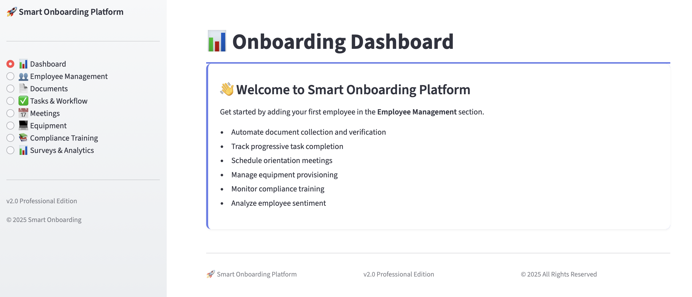
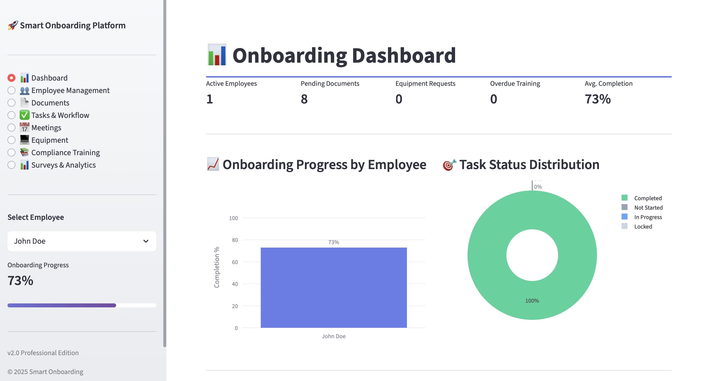
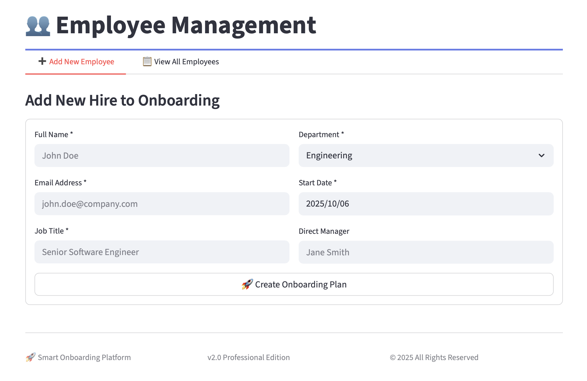
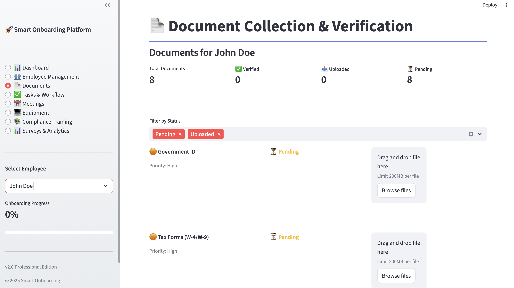
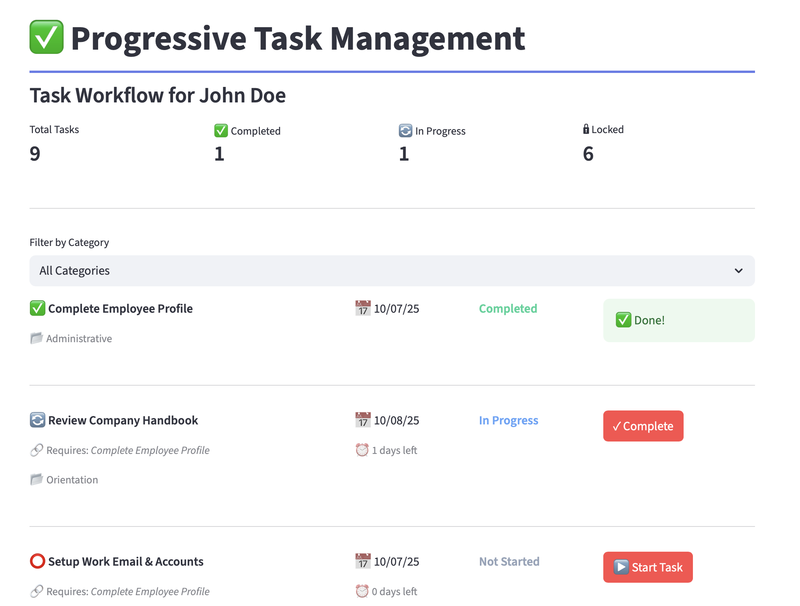
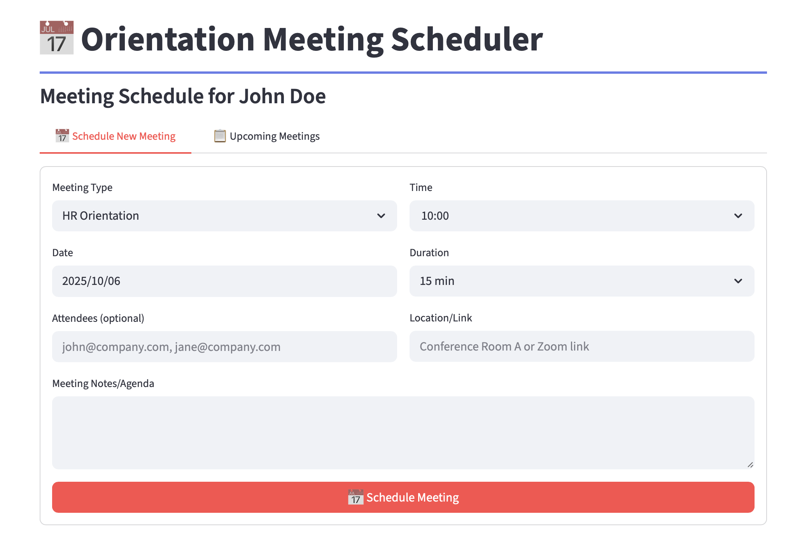
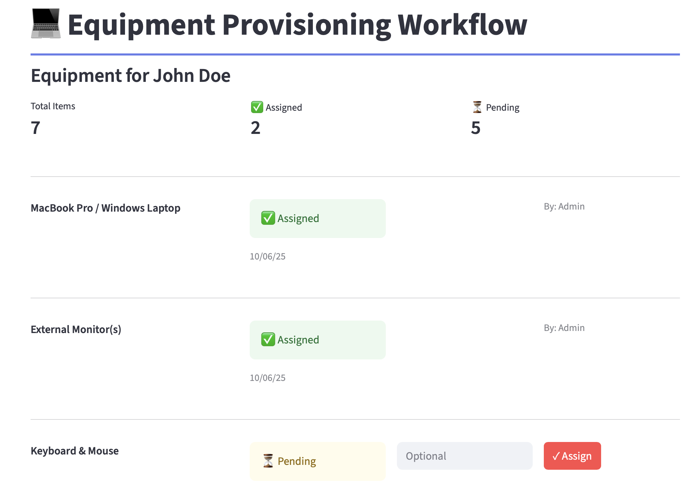
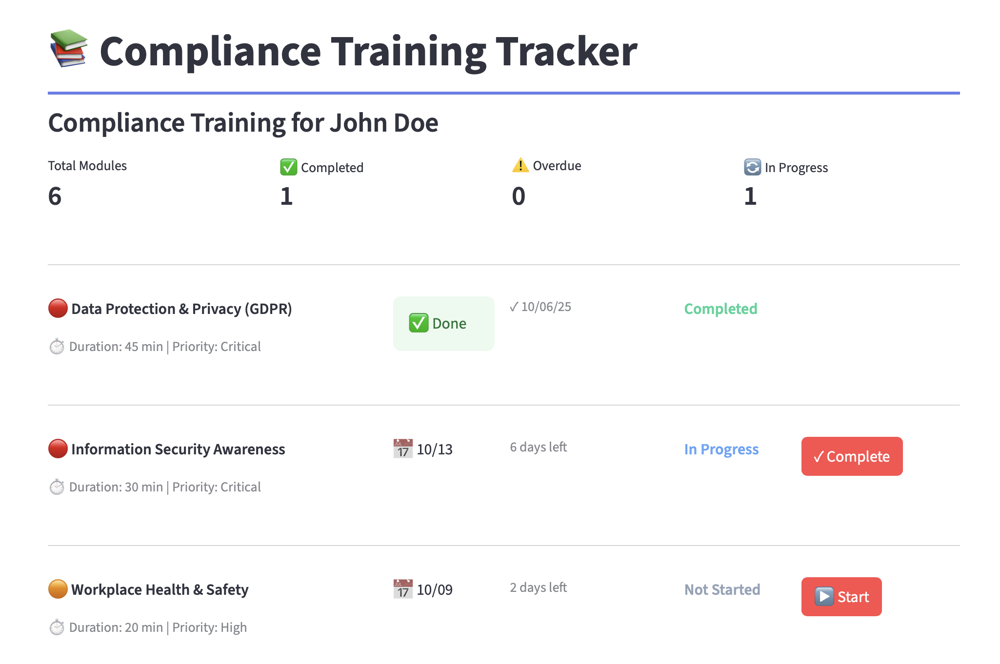
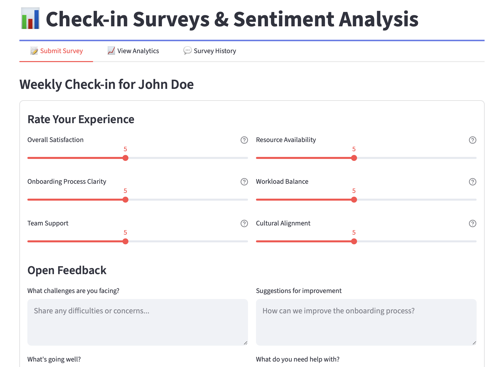

# 🚀 Onboarding Assistant

An **AI-powered, intelligent employee onboarding management system** that automates document collection, task workflows, compliance training, and provides real-time analytics for HR teams.

---

## ✨ Features

### **Core Functionality**

- 📊 **Real-time Analytics Dashboard** – Visual insights into onboarding progress, task completion, and employee sentiment  
- 👥 **Employee Management** – Complete employee lifecycle tracking from day one  
- 📄 **Document Verification System** – Automated document collection with priority-based workflows  
- ✅ **Progressive Task Workflows** – Dependency-based task unlocking system  
- 📅 **Meeting Scheduler** – Integrated orientation and team meeting management  
- 💻 **Equipment Provisioning** – Track and assign company equipment with serial number management  
- 📚 **Compliance Training Tracker** – Monitor mandatory training with automatic reminders  
- 📊 **Sentiment Analysis** – Weekly check-ins with trend analysis and actionable insights  

### **Advanced Features**

- Dynamic progress tracking with completion percentages  
- Priority-based document management (Critical / High / Medium / Low)  
- Automated task dependency chains  
- Multi-category filtering and search  
- Real-time status updates  
- Responsive design for mobile and desktop  
- Export-ready analytics  

---

## 🛠️ Tech Stack

### **Frontend & Framework**
- 🐍 **Python** – Core programming language for backend and logic  
- ⚡ **Streamlit** – Interactive web application framework for rapid UI development  

### **Data & Analytics**
- 📊 **Pandas** – Data manipulation and analytics  
- 🔢 **NumPy** – Numerical computations and data handling  

### **Visualization**
- 📈 **Plotly Express** – Interactive charts and graphs for dashboards  
- 📊 **Plotly Graph Objects** – Custom and advanced data visualizations  
- 🎨 **Custom CSS** – Professional styling, layout design, and animations  

### **Development Tools**
- 🐳 **Docker** – Containerized deployment and environment consistency  
- 🧩 **Virtual Environments (venv)** – Dependency isolation  
- 🌿 **Git & GitHub** – Version control and collaboration  
- 🚀 **Streamlit CLI** – Local development and deployment management 

---

## 🎥 Demo

🔗 **Live Demo:** [Onboarding Assistant](https://onbassistant.streamlit.app)

---

## 🎯 Key Capabilities

### 🧩 **Intelligent Task Dependencies**
Tasks unlock progressively based on the completion of prerequisite tasks, ensuring a structured and seamless onboarding experience.

### 📄 **Priority-Based Document Management**
Documents are categorized by priority (**Critical / High / Medium / Low**) with visual indicators to highlight urgent items.

### 📈 **Real-time Progress Tracking**
The dashboard provides instant visibility into completion rates across all onboarding dimensions, enabling proactive management.

### ⏰ **Automated Compliance Reminders**
The system monitors training due dates and sends automatic reminders for overdue modules to maintain compliance effortlessly.

### 💬 **Sentiment Analysis**
Weekly check-in surveys capture employee feedback with trend analysis to identify potential issues early and improve retention.

---

## 📸 Screenshots

