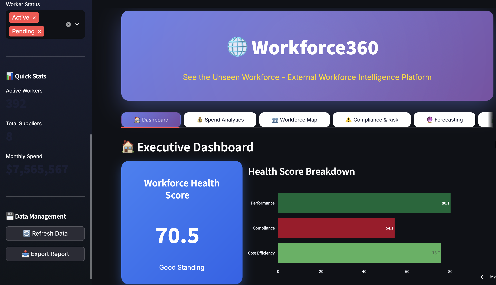
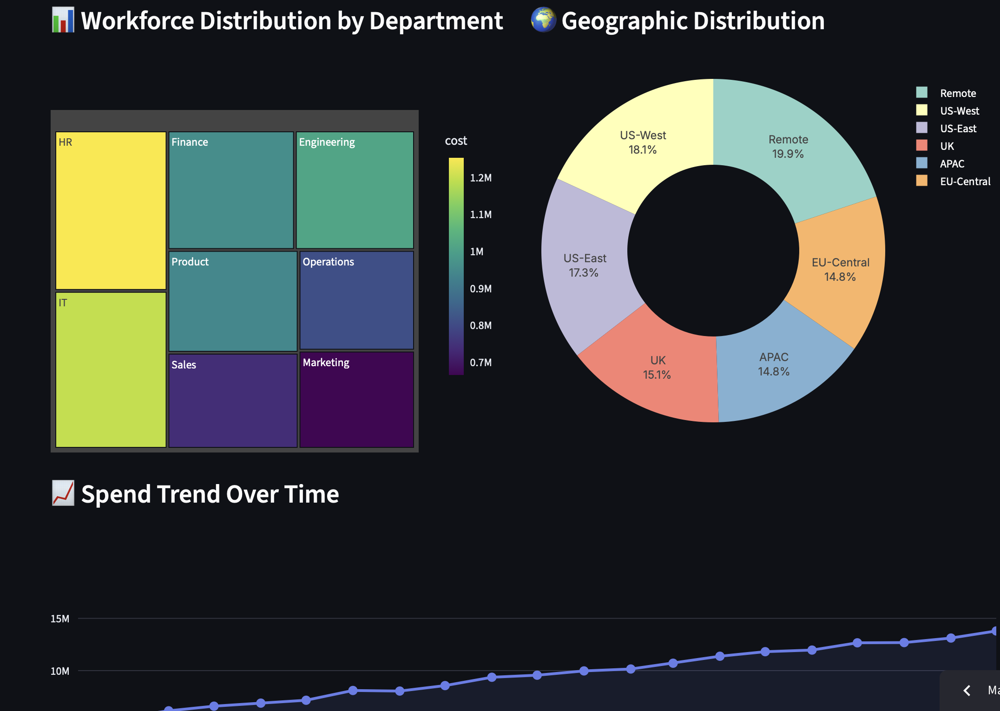
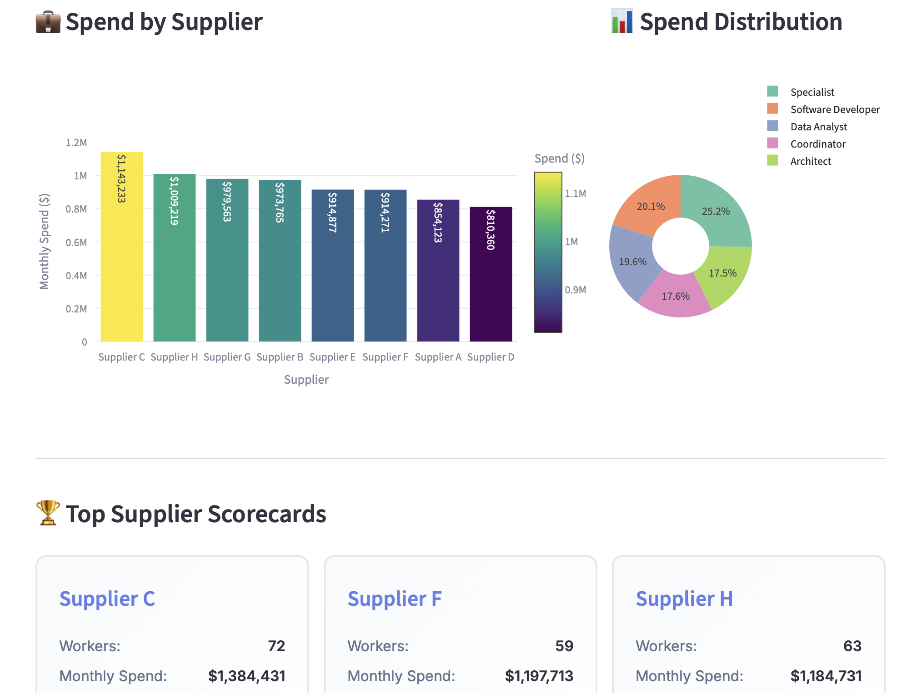
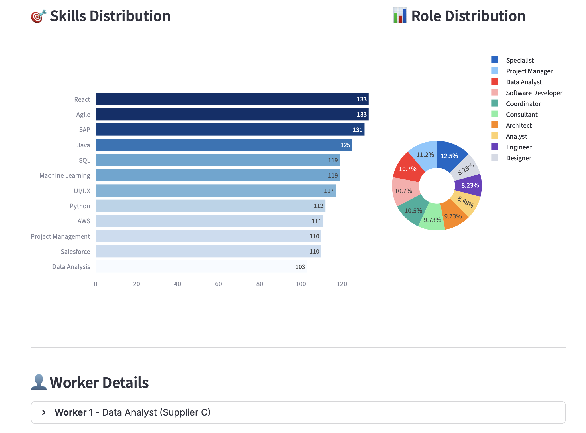
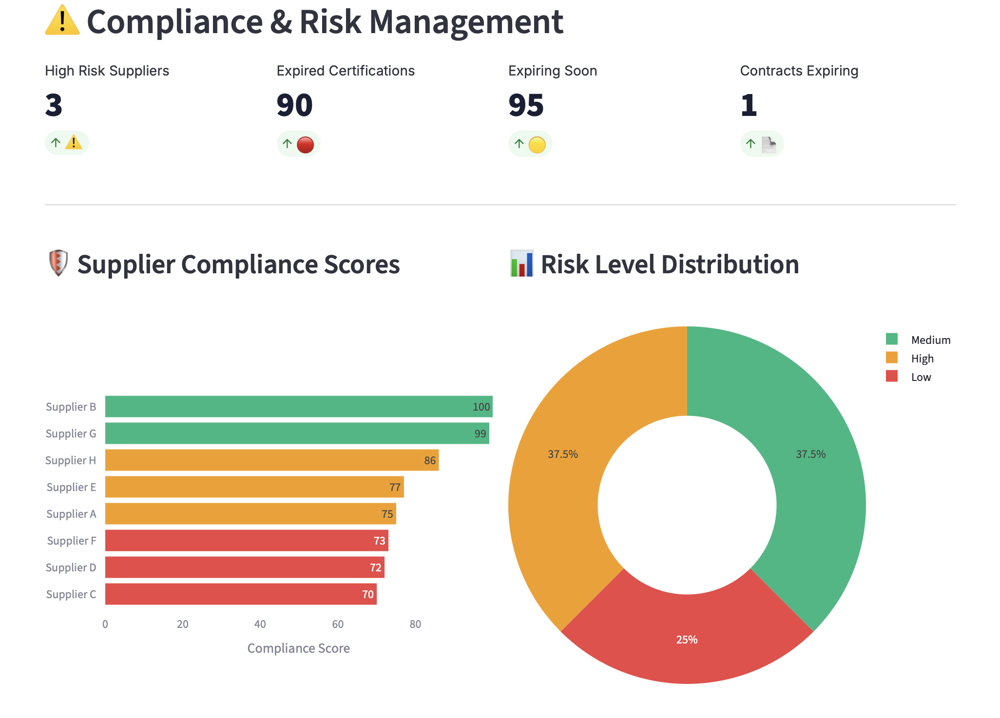
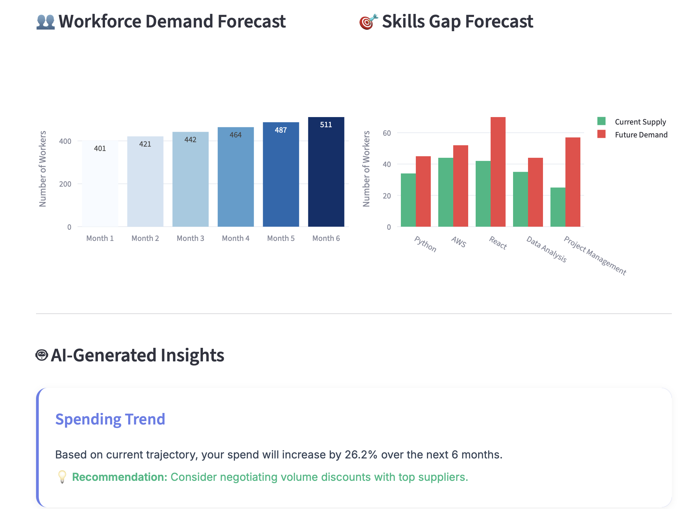

# 🌐 Workforce360 - External Workforce Intelligence Platform
**See the Unseen Workforce™**

*AI-Powered Intelligence Platform for Managing External Workforce at Scale*

  

👉 Try the app: **[Demo Link (Streamlit)](https://workforce360.streamlit.app)**  
👉 Explore the code: **[GitHub Repository](https://github.com/cersei568/workforce360)**  

## 🎯 Overview

**Workforce360** is a comprehensive SaaS platform that aggregates all external worker data from HR systems, procurement, finance, and project management tools into one unified, intelligent dashboard. It gives Procurement, HR, and Finance leaders real-time visibility into their contingent workforce with predictive analytics and compliance monitoring.

 

 

 

 

 


### 💡 The Problem We Solve

Modern enterprises rely heavily on external workers (contractors, consultants, freelancers, agencies), but this workforce is typically:
- **Fragmented** across multiple systems and spreadsheets
- **Invisible** to leadership and financial planning
- **Unmanaged** from a compliance and risk perspective
- **Costly** due to lack of optimization and visibility

### 🎁 The Workforce360 Solution

A single source of truth for your entire external workforce with:
- ✅ **360° Visibility** - See all workers, costs, and suppliers in one place
- ✅ **Workforce Health Score** - Single metric rating efficiency, compliance, and performance
- ✅ **Predictive Analytics** - AI-powered forecasting for spend and demand
- ✅ **Compliance Monitoring** - Automated risk detection and alerts
- ✅ **Skills Intelligence** - Map skills, availability, and gaps instantly
- ✅ **Cost Optimization** - Identify savings opportunities and optimize rates

---

## 🚀 Key Features

### 🏠 **Executive Dashboard**
The command center for your external workforce:
- **Workforce Health Score** (0-100) - Composite metric combining cost efficiency, compliance, and performance
- **Real-time Metrics** - Active workers, monthly spend, suppliers, contracts
- **Interactive Visualizations** - Department distribution, geographic mapping, spend trends
- **Live Alerts** - Critical issues requiring immediate attention
- **Trend Analysis** - Historical spend patterns and growth tracking

### 💰 **Spend Analytics & Supplier Intelligence**
Deep financial insights and supplier management:
- **Total Spend Visibility** - Monthly, quarterly, and annual projections
- **Supplier Scorecards** - Performance, compliance, and risk ratings for each supplier
- **Cost Breakdowns** - By department, role, location, and project
- **Rate Analysis** - Identify high-cost suppliers and opportunities for negotiation
- **Spend Trends** - Visualize cost patterns over time
- **Supplier Comparison** - Benchmark suppliers against each other

### 👥 **Interactive Workforce Map**
Find and manage workers with precision:
- **Advanced Search** - Filter by skills, role, department, location, supplier
- **Skills Distribution** - See what skills are available across your workforce
- **Worker Profiles** - Detailed view of each contractor with performance metrics
- **Availability Calendar** - Heatmap showing resource availability
- **Skills Tags** - Quick identification of worker capabilities
- **Contract Status** - Track active, pending, and expired engagements

### ⚠️ **Compliance & Risk Management**
Proactive risk monitoring and mitigation:
- **Automated Risk Detection** - Identify high-risk suppliers and workers
- **Compliance Scoring** - Rate suppliers on certifications, insurance, legal status
- **Certification Tracking** - Monitor expiring and expired certifications
- **Contract Renewals** - Timeline view of upcoming contract expirations
- **Alert System** - Prioritized notifications for critical compliance issues
- **Audit Trail** - Complete history for compliance reporting

### 🔮 **Predictive Analytics & Forecasting**
AI-powered insights for strategic planning:
- **6-Month Spend Forecast** - Predict future costs with confidence intervals
- **Workforce Demand Prediction** - Anticipate staffing needs by role and skill
- **Skills Gap Analysis** - Identify future skill shortages before they happen
- **Budget Planning** - Project annual spend with growth scenarios
- **AI Recommendations** - Actionable insights for cost optimization
- **Scenario Modeling** - What-if analysis for strategic decisions

### 📊 **Custom Reports & Exports**
Flexible reporting for all stakeholders:
- **Report Builder** - Create custom reports with drag-and-drop
- **Multiple Formats** - Export to PDF, Excel, CSV, PowerPoint
- **Scheduled Reports** - Automated delivery to stakeholders
- **Executive Summaries** - One-page snapshots for leadership
- **Detailed Analytics** - Deep-dive reports for specialists
- **Shareable Dashboards** - Secure links for external sharing

---

## 🛠️ Tech Stack

### **Frontend Framework**
- **[Streamlit](https://streamlit.io/)** `v1.32.0` - Modern Python web framework for data apps
  - Native Python syntax - no JavaScript required
  - Hot-reloading for rapid development
  - Built-in caching and session state management
  - Widget-based interactivity

### **Data Processing & Analysis**
- **[Pandas](https://pandas.pydata.org/)** `v2.2.0` - Data manipulation and analysis
  - DataFrame operations for complex workforce data
  - Groupby aggregations for analytics
  - Time-series analysis for trends
- **[NumPy](https://numpy.org/)** `v1.26.4` - Numerical computing
  - Statistical calculations
  - Array operations for performance metrics
  - Mathematical modeling for forecasts

### **Data Visualization**
- **[Plotly](https://plotly.com/python/)** `v5.19.0` - Interactive charts and graphs
  - **Chart Types Used:**
    - Treemaps for hierarchical workforce distribution
    - Pie/Donut charts for categorical distributions
    - Line charts for time-series trends
    - Bar charts (horizontal/vertical) for comparisons
    - Scatter plots for multi-dimensional analysis
    - Heatmaps for availability and correlation
    - Area charts with confidence intervals for forecasts
  - **Features:**
    - Interactive hover tooltips
    - Zoom and pan capabilities
    - Export to PNG/SVG
    - Responsive design

### **Python Standard Libraries**
- **datetime** - Date and time manipulation for contract tracking
- **timedelta** - Time calculations for expiration alerts
- **collections.Counter** - Frequency analysis for skills
- **random** - Sample data generation
- **json** - Data serialization for exports

### **Architecture**

```
┌─────────────────────────────────────────────────────┐
│          Streamlit Web Interface Layer              │
│  ├─ Dashboard Tab (Executive Overview)              │
│  ├─ Spend Analytics Tab (Financial Intelligence)    │
│  ├─ Workforce Map Tab (Worker Management)           │
│  ├─ Compliance Tab (Risk Monitoring)                │
│  ├─ Forecasting Tab (Predictive Analytics)          │
│  └─ Reports Tab (Custom Reporting)                  │
├─────────────────────────────────────────────────────┤
│         Session State Management Layer              │
│  ├─ workers_data (Worker records)                   │
│  ├─ suppliers_data (Supplier information)           │
│  ├─ contracts_data (Contract details)               │
│  └─ alerts (Risk notifications)                     │
├─────────────────────────────────────────────────────┤
│           Business Logic Layer                      │
│  ├─ Health Score Calculator (Composite metrics)     │
│  ├─ Risk Identification Engine (Compliance)         │
│  ├─ Forecast Generator (AI predictions)             │
│  ├─ Skills Mapper (Capability tracking)             │
│  └─ Alert Generator (Notification system)           │
├─────────────────────────────────────────────────────┤
│         Data Processing Layer                       │
│  ├─ Pandas DataFrames (In-memory storage)           │
│  ├─ Aggregation Engine (Analytics calculations)     │
│  ├─ Filter Engine (Dynamic queries)                 │
│  └─ Export Engine (Report generation)               │
├─────────────────────────────────────────────────────┤
│         Visualization Layer                         │
│  ├─ Plotly Charts (Interactive graphs)              │
│  ├─ Custom CSS (Professional styling)               │
│  └─ Responsive Layouts (Multi-column grids)         │
└─────────────────────────────────────────────────────┘
```

---

## 💻 Usage Guide

### **1. Dashboard Navigation**

The platform is organized into 6 main tabs:

#### **🏠 Dashboard** - Executive Overview
- View Workforce Health Score
- Monitor key metrics (workers, spend, suppliers)
- Analyze trends and distributions
- Review active alerts

#### **💰 Spend Analytics** - Financial Intelligence
- Track total annual and monthly spend
- Analyze spend by supplier and department
- Review supplier scorecards
- Identify cost optimization opportunities

#### **👥 Workforce Map** - Resource Management
- Search workers by skills and attributes
- View skills distribution and availability
- Access detailed worker profiles
- Plan resource allocation

#### **⚠️ Compliance & Risk** - Risk Mitigation
- Monitor compliance scores
- Track certification expiration
- Review contract renewal timeline
- Manage risk alerts

#### **🔮 Forecasting** - Predictive Planning
- View 6-month spend forecast
- Predict workforce demand
- Identify skills gaps
- Review AI-generated insights

#### **📊 Reports** - Custom Reporting
- Build custom reports
- Schedule automated delivery
- Export in multiple formats
- Share dashboards securely

### **2. Filtering & Search**

Use the sidebar controls to filter data:

```python
# Filter by Department
Departments → Select one or more departments

# Filter by Location
Locations → Choose geographic regions

# Filter by Supplier
Suppliers → Select specific agencies

# Filter by Status
Worker Status → Active, Pending, Expired
```

### **3. Understanding the Health Score**

The Workforce Health Score (0-100) provides an at-a-glance assessment:

| Score Range | Rating | Meaning |
|-------------|--------|---------|
| 85-100 | Excellent | Optimal performance across all dimensions |
| 70-84 | Good | Strong performance with minor improvements needed |
| 55-69 | Warning | Significant issues requiring attention |
| 0-54 | Critical | Immediate action required |

**Components:**
- **Cost Efficiency (40%)** - Are you paying competitive rates?
- **Compliance (30%)** - Are certifications and policies current?
- **Performance (30%)** - Are workers meeting expectations?

### **4. Alert System**

Alerts are categorized by priority:

- 🔴 **High Priority** - Immediate action required (expired compliance, high attrition risk)
- 🟡 **Medium Priority** - Action needed soon (upcoming renewals, cost concerns)
- 🔵 **Low Priority** - Informational (trends, insights)

### **5. Exporting Data**

Export options available throughout the platform:

```bash
# Quick Exports (CSV)
- Workers data
- Suppliers data
- Contracts data

# Custom Reports (Multiple formats)
- Executive Summary (PDF)
- Detailed Workforce (Excel)
- Compliance Report (PDF)
- Cost Analysis (Excel)
```

---

## 🎯 Use Cases

### **For Chief Procurement Officers (CPOs)**
- **Visibility**: See total contingent workforce spend across organization
- **Optimization**: Identify high-cost suppliers and negotiate better rates
- **Compliance**: Ensure all suppliers meet company standards
- **Forecasting**: Plan budgets with accurate spend predictions

### **For HR Leaders**
- **Resource Planning**: Understand current and future staffing needs
- **Skills Management**: Map available skills and identify gaps
- **Performance Tracking**: Monitor contractor performance
- **Compliance**: Track certifications and legal requirements

### **For Finance Teams**
- **Budget Control**: Real-time spend tracking and forecasting
- **Cost Analysis**: Detailed breakdown of contingent workforce costs
- **Contract Management**: Monitor contract values and renewals
- **Reporting**: Automated financial reports for stakeholders

### **For Project Managers**
- **Resource Discovery**: Find workers with specific skills quickly
- **Availability Planning**: See who's available when
- **Cost Tracking**: Monitor project-specific contractor costs
- **Performance Management**: Track contractor contributions

---

## 📊 Sample Data

The application includes 500+ sample records for immediate exploration:

- **500 External Workers** across 8 departments
- **8 Suppliers** with varying performance levels
- **24 Active Contracts** with different terms
- **180 Days** of historical data
- **15+ Skills** categories tracked
- **6 Geographic** locations

---

## 🔒 Security & Privacy

### **Data Protection**
- ✅ All data processed locally - no external storage
- ✅ Session-based storage - cleared on browser close
- ✅ No personal data transmitted to third parties
- ✅ Configurable data retention policies
- ✅ Role-based access control (enterprise version)

### **Best Practices**
```
1. Run on secure internal networks
2. Use HTTPS in production deployments
3. Implement authentication (Streamlit Cloud Auth)
4. Regular security audits
5. Comply with GDPR, CCPA regulations
```
---

## 📄 License

This project is licensed under the MIT License - see the [LICENSE](LICENSE) file for details.

---

**Made with ❤️ for better workforce management**
# workforce360
